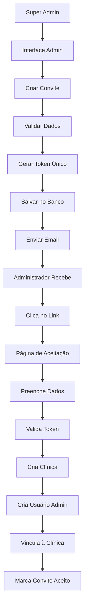

# Sistema de Administração de Clínicas e Convites

## Visão Geral

O sistema administrativo do Operabase permite que super administradores gerenciem clínicas e enviem convites para criação de novas clínicas no sistema. Este documento detalha todo o fluxo de criação de clínicas através de convites seguros com tokens únicos.

## Características Principais

- **Gestão Centralizada**: Super admins controlam criação de novas clínicas
- **Sistema de Convites**: Processo seguro com tokens únicos de 64 caracteres
- **Expiração Automática**: Convites válidos por 7 dias
- **Email Templates**: Templates HTML responsivos para convites
- **Validação Completa**: Verificação de dados e status dos convites
- **Interface Administrativa**: Dashboard completo para gestão de convites

## Arquitetura do Sistema

### Fluxo Completo



## Estrutura de Dados

### Tabela: clinic_invitations

```sql
CREATE TABLE clinic_invitations (
  id SERIAL PRIMARY KEY,
  email VARCHAR(255) NOT NULL,
  admin_name VARCHAR(255) NOT NULL,
  clinic_name VARCHAR(255) NOT NULL,
  token VARCHAR(255) NOT NULL UNIQUE,
  status VARCHAR(50) DEFAULT 'pending', -- pending, accepted, cancelled
  expires_at TIMESTAMP NOT NULL,
  created_by_user_id INTEGER NOT NULL,
  clinic_id INTEGER NULL, -- Preenchido após aceitação
  created_at TIMESTAMP DEFAULT CURRENT_TIMESTAMP
);
```

### Tabela: clinics (Campos Relevantes)

```sql
CREATE TABLE clinics (
  id SERIAL PRIMARY KEY,
  name TEXT NOT NULL,
  responsible TEXT NOT NULL,
  email TEXT,
  celular TEXT,
  whatsapp_number TEXT DEFAULT '', -- Campo obrigatório no banco, valor padrão vazio
  status VARCHAR(50) DEFAULT 'active',
  created_at TIMESTAMP DEFAULT CURRENT_TIMESTAMP,
  updated_at TIMESTAMP DEFAULT CURRENT_TIMESTAMP
  -- outros campos...
);
```

### Índices de Performance

```sql
CREATE INDEX idx_invitations_email ON clinic_invitations(email);
CREATE INDEX idx_invitations_token ON clinic_invitations(token);
CREATE INDEX idx_invitations_status ON clinic_invitations(status);
CREATE INDEX idx_invitations_expires_at ON clinic_invitations(expires_at);
```

## API Endpoints

### 1. Listar Clínicas (Super Admin)

```http
GET /api/clinics
Authorization: Bearer <token>
```

**Response:**
```json
{
  "clinics": [
    {
      "id": 1,
      "name": "Clínica Exemplo",
      "responsible": "Dr. João Silva",
      "email": "admin@clinica.com",
      "status": "active",
      "created_at": "2024-01-15T10:00:00Z",
      "total_professionals": 3
    }
  ],
  "total": 1
}
```

### 2. Criar Convite de Clínica

```http
POST /api/clinics/invitations
Authorization: Bearer <token>
Content-Type: application/json

{
  "admin_email": "admin@novaclinica.com",
  "admin_name": "Dr. Maria Santos",
  "clinic_name": "Clínica Nova"
}
```

**Response:**
```json
{
  "id": 1,
  "email": "admin@novaclinica.com",
  "admin_name": "Dr. Maria Santos",
  "clinic_name": "Clínica Nova",
  "token": "a1b2c3d4e5f6...64chars",
  "status": "pending",
  "expires_at": "2024-01-22T10:00:00Z",
  "created_at": "2024-01-15T10:00:00Z"
}
```

### 3. Listar Convites

```http
GET /api/clinics/invitations?status=pending&page=1&limit=100
Authorization: Bearer <token>
```

**Response:**
```json
{
  "invitations": [
    {
      "id": 1,
      "email": "admin@novaclinica.com",
      "admin_name": "Dr. Maria Santos",
      "clinic_name": "Clínica Nova",
      "status": "pending",
      "expires_at": "2024-01-22T10:00:00Z",
      "created_at": "2024-01-15T10:00:00Z"
    }
  ],
  "total": 1,
  "page": 1,
  "limit": 100,
  "totalPages": 1
}
```

### 4. Obter Convite por Token (Público)

```http
GET /api/clinics/invitations/:token
```

**Response:**
```json
{
  "id": 1,
  "email": "admin@novaclinica.com",
  "admin_name": "Dr. Maria Santos",
  "clinic_name": "Clínica Nova",
  "status": "pending",
  "expires_at": "2024-01-22T10:00:00Z",
  "created_at": "2024-01-15T10:00:00Z"
}
```

### 5. Aceitar Convite (Público)

```http
POST /api/clinics/invitations/:token/accept
Content-Type: application/json

{
  "name": "Dr. Maria Santos",
  "email": "maria@novaclinica.com",
  "clinicName": "Clínica Nova",
  "password": "senhaSegura123"
}
```

**Response:**
```json
{
  "message": "Convite aceito com sucesso",
  "clinic": {
    "id": 2,
    "name": "Clínica Nova",
    "responsible": "Dr. Maria Santos",
    "status": "active"
  },
  "user": {
    "id": 5,
    "name": "Dr. Maria Santos",
    "email": "maria@novaclinica.com",
    "role": "admin"
  }
}
```

### 6. Cancelar Convite

```http
DELETE /api/clinics/invitations/:id
Authorization: Bearer <token>
```

**Response:**
```json
{
  "message": "Convite cancelado com sucesso"
}
```

## Interface Administrativa

### Componente Principal: ClinicsManagement

**Localização**: `client/src/pages/admin/clinics.tsx`

#### Funcionalidades:

1. **Dashboard de Resumo**
   - Total de clínicas ativas
   - Convites pendentes
   - Estatísticas gerais

2. **Tabela de Clínicas**
   - Lista todas as clínicas registradas
   - Informações de responsável, email, status
   - Data de criação e total de profissionais

3. **Gestão de Convites**
   - Lista todos os convites enviados
   - Status visual (pendente, aceito, cancelado)
   - Ações de cancelamento
   - Cópia do link do convite

#### Modal de Criação de Convite

```typescript
interface CreateInvitationForm {
  email: string;
  adminName: string;
  clinicName: string;
}

const createInvitationSchema = z.object({
  email: z.string().email('Email inválido'),
  adminName: z.string().min(2, 'Nome deve ter no mínimo 2 caracteres'),
  clinicName: z.string().min(2, 'Nome da clínica deve ter no mínimo 2 caracteres')
});
```

#### Link de Convite

Após criação, o sistema gera um link único:
```
https://operabase.com/convite-clinica/a1b2c3d4e5f6...64chars
```

## Página de Aceitação de Convite

### Componente: ConviteClinica

**Localização**: `client/src/pages/ConviteClinica.tsx`

#### Funcionalidades:

1. **Validação do Token**
   - Verifica se o token existe
   - Verifica se não expirou
   - Verifica se status é 'pending'

2. **Exibição de Informações**
   - Nome da clínica convidada
   - Email original do convite
   - Data de expiração

3. **Formulário de Aceitação**
   ```typescript
   interface AcceptInvitationForm {
     name: string;
     email: string;
     clinicName: string;
     password: string;
     confirmPassword: string;
   }
   ```

4. **Estados da Interface**
   - Loading (carregando convite)
   - Error (convite inválido/expirado)
   - Form (formulário de aceitação)
   - Success (convite aceito com sucesso)

#### Roteamento

```typescript
// Em App.tsx
if (location.startsWith('/convite-clinica/')) {
  return (
    <WouterRouter>
      <Route path="/convite-clinica/:token" component={ConviteClinica} />
    </WouterRouter>
  );
}
```

## Serviço de Email

### SupabaseEmailService

**Localização**: `server/services/email.service.ts`

#### Template de Convite

O sistema utiliza um template HTML responsivo com:

- **Header**: Logo e branding da Operabase
- **Conteúdo Principal**: 
  - Saudação personalizada
  - Informações sobre a plataforma
  - Lista de funcionalidades
  - Botão de call-to-action
- **Informações Importantes**: Prazo de expiração
- **Próximos Passos**: Instruções detalhadas
- **Footer**: Informações legais e link alternativo

#### Configuração de URL Base

```typescript
constructor() {
  this.baseUrl = process.env.NODE_ENV === 'production' 
    ? `https://${process.env.REPL_SLUG}.${process.env.REPL_OWNER}.repl.co`
    : 'http://localhost:3000'; // Porta 3000 configurada no .env
}
```

### Configuração do Servidor

O servidor utiliza a porta configurada no arquivo `.env`:

```bash
# .env
PORT=3000
```

```typescript
// server/index.ts
const port = parseInt(process.env.PORT || '3000', 10);
```

**Comando de desenvolvimento**:
```bash
npm run dev
# Executa: NODE_ENV=development tsx --env-file=.env server/index.ts
```

#### Método de Envio

```typescript
async sendClinicInvitation(
  email: string,
  adminName: string,
  clinicName: string,
  token: string
): Promise<EmailServiceResponse>
```

## Lógica de Negócio

### ClinicsService

**Localização**: `server/domains/clinics/clinics.service.ts`

#### 1. Criar Convite

```typescript
async createInvitation(data: {
  admin_email: string;
  admin_name: string;
  clinic_name: string;
  created_by_user_id: number;
})
```

**Processo:**
1. Gera token seguro de 32 bytes (64 chars hex)
2. Define expiração para 7 dias
3. Salva convite no banco
4. Envia email via EmailService
5. Retorna dados do convite

#### 2. Validar Token

```typescript
async getInvitationByToken(token: string)
```

**Validações:**
- Token existe no banco
- Status é 'pending'
- Não está expirado

#### 3. Aceitar Convite

```typescript
async acceptInvitation(token: string, formData: {
  name: string;
  email: string;
  clinicName: string;
  password: string;
})
```

**Processo Transacional:**
1. Valida token (existência, status 'pending', não expirado)
2. Cria nova clínica com dados do formulário
   - Fornece valores padrão para campos obrigatórios (celular, whatsapp_number)
   - Define status como 'active'
3. Cria usuário administrador com senha hash (bcrypt)
4. Vincula usuário à clínica como admin com is_professional=true
5. Marca convite como aceito e associa clinic_id
6. Retorna dados da clínica e usuário criados

## Segurança

### Geração de Tokens

```typescript
const token = crypto.randomBytes(32).toString('hex');
```

- **Tamanho**: 32 bytes (256 bits)
- **Formato**: Hexadecimal (64 caracteres)
- **Entropia**: Criptograficamente seguro

### Validações de Segurança

1. **Verificação de Email Único**
   - Antes de criar convite
   - Antes de aceitar convite

2. **Expiração Temporal**
   - 7 dias de validade
   - Verificação automática

3. **Status Control**
   - Apenas convites 'pending' podem ser aceitos
   - Prevenção de reuso

4. **Autenticação de Admin**
   - Apenas super_admin pode criar convites
   - Middleware de autenticação

### Hash de Senhas

```typescript
const hashedPassword = await bcrypt.hash(formData.password, 10);
```

## Configuração de Permissões

### Middleware de Autorização

```typescript
// Rotas protegidas (super admin)
router.get('/', isAuthenticated, requireRole(['super_admin']));
router.post('/invitations', isAuthenticated, requireRole(['super_admin']));

// Rotas públicas
router.get('/invitations/:token');
router.post('/invitations/:token/accept');
```

### Criação de Clínica

Quando o convite é aceito, uma nova clínica é criada:

```typescript
const [newClinic] = await db
  .insert(clinics)
  .values({
    name: formData.clinicName,
    responsible: formData.name,
    email: formData.email,
    status: 'active',
    celular: '', // Valor padrão vazio
    whatsapp_number: '' // Valor padrão vazio para campo obrigatório no banco
  })
  .returning();
```

### Criação de Usuário Admin

```typescript
const hashedPassword = await bcrypt.hash(formData.password, 10);

const [newUser] = await db
  .insert(users)
  .values({
    name: formData.name,
    email: formData.email,
    password: hashedPassword,
    role: 'admin' // Automaticamente admin da clínica
  })
  .returning();
```

### Vinculação à Clínica

```typescript
await db
  .insert(clinic_users)
  .values({
    user_id: newUser.id,
    clinic_id: newClinic.id,
    role: 'admin',
    is_professional: true,
    is_active: true
  });
```

## Monitoramento e Logs

### Logs do Sistema

Todas as operações geram logs:

- **Criação de Convite**: Log de ação administrativa
- **Envio de Email**: Log de comunicação
- **Aceitação**: Log de criação de clínica e usuário
- **Cancelamento**: Log de ação administrativa

### Métricas de Acompanhamento

- Total de convites enviados
- Taxa de aceitação
- Convites expirados
- Tempo médio de aceitação

## Tratamento de Erros

### Erros Comuns

1. **Token Inválido/Expirado**
   ```json
   {
     "error": "Convite não encontrado ou expirado"
   }
   ```

2. **Email Já Utilizado**
   ```json
   {
     "error": "Este email já está sendo usado por outro usuário"
   }
   ```

3. **Convite Já Aceito**
   ```json
   {
     "error": "Este convite já foi aceito"
   }
   ```

4. **Campos Obrigatórios Faltantes**
   ```json
   {
     "error": "Todos os campos são obrigatórios: name, email, clinicName, password"
   }
   ```

5. **Dados Inválidos (Validação Zod)**
   ```json
   {
     "error": "Dados inválidos",
     "details": [
       {
         "field": "email",
         "message": "Email inválido"
       }
     ]
   }
   ```

6. **Erro Interno do Servidor**
   ```json
   {
     "error": "Erro interno do servidor"
   }
   ```

### Problemas Resolvidos

#### Erro: "whatsapp_number violates not-null constraint"

**Problema**: A tabela `clinics` no banco tinha uma coluna `whatsapp_number` com constraint NOT NULL, mas o formulário de convite não coletava esse dado.

**Solução Implementada**:
1. Adicionado campo `whatsapp_number` ao schema com valor padrão vazio
2. Fornecido valor padrão vazio no insert da clínica
3. Mantido formulário focado apenas nos dados essenciais

```typescript
// Schema corrigido
whatsapp_number: text("whatsapp_number").default(""),

// Insert corrigido
.values({
  name: formData.clinicName,
  responsible: formData.name,
  email: formData.email,
  status: 'active',
  celular: '',
  whatsapp_number: '' // Valor padrão para campo obrigatório
})
```

## Exemplo de Uso Completo

### 1. Super Admin Cria Convite

```bash
curl -X POST "https://operabase.com/api/clinics/invitations" \
  -H "Authorization: Bearer <super_admin_token>" \
  -H "Content-Type: application/json" \
  -d '{
    "admin_email": "dr.silva@novaclinica.com",
    "admin_name": "Dr. João Silva",
    "clinic_name": "Clínica Silva & Associados"
  }'
```

### 2. Sistema Gera Token e Envia Email

- Token: `a1b2c3d4e5f67890...` (64 chars)
- Link: `https://operabase.com/convite-clinica/a1b2c3d4...`
- Email com template HTML enviado

### 3. Administrador Acessa Link

- Abre página de aceitação
- Vê informações do convite
- Preenche formulário

### 4. Aceitação do Convite

```bash
curl -X POST "https://operabase.com/api/clinics/invitations/a1b2c3d4.../accept" \
  -H "Content-Type: application/json" \
  -d '{
    "name": "Dr. João Silva",
    "email": "joao@clinicasilva.com",
    "clinicName": "Clínica Silva & Associados",
    "password": "minhasenhasegura123"
  }'
```

### 5. Sistema Cria Clínica e Usuário

- Nova clínica cadastrada
- Usuário admin criado
- Vinculação estabelecida
- Convite marcado como aceito

## Extensões Futuras

### Melhorias Planejadas

1. **Convites para Equipe**
   - Convites para profissionais
   - Diferentes níveis de permissão

2. **Templates Personalizáveis**
   - Customização de emails
   - Branding por clínica

3. **Renovação de Convites**
   - Reenvio de convites expirados
   - Extensão de prazo

4. **Auditoria Avançada**
   - Rastreamento completo
   - Relatórios de conversão

5. **Integração com CRM**
   - Pipeline de clínicas
   - Acompanhamento comercial

## Considerações de Performance

### Otimizações Implementadas

1. **Índices de Banco**
   - Token (busca rápida)
   - Status (filtragem)
   - Expiração (limpeza automática)

2. **Validação Eficiente**
   - Verificações em cascata
   - Early returns

3. **Cache de Consultas**
   - React Query no frontend
   - Cache de instâncias ativas

### Métricas de Performance

- Criação de convite: < 100ms
- Validação de token: < 50ms
- Aceitação completa: < 500ms
- Interface responsiva: < 200ms

## Troubleshooting

### Problemas Comuns e Soluções

#### 1. Erro "Failed to fetch" no Frontend

**Sintomas**: Erro de conexão ao tentar aceitar convite
**Causa**: Servidor não está rodando ou rodando na porta errada
**Solução**:
```bash
# Verificar se servidor está rodando
lsof -ti:3000

# Iniciar servidor na porta correta
npm run dev

# Verificar se .env tem PORT=3000
cat .env | grep PORT
```

#### 2. Erro "supabaseUrl is required"

**Sintomas**: Servidor falha ao iniciar
**Causa**: Arquivo .env não está sendo carregado
**Solução**:
```bash
# Usar comando correto que carrega .env
npx tsx --env-file=.env server/index.ts

# Ou usar npm run dev (já configurado)
npm run dev
```

#### 3. Erro "whatsapp_number violates not-null constraint"

**Sintomas**: Erro 500 ao aceitar convite
**Causa**: Campo obrigatório no banco não fornecido
**Solução**: ✅ **Já corrigido** - Schema atualizado com valor padrão

#### 4. Conflito de Schemas

**Sintomas**: Erros de tipo TypeScript
**Causa**: Tabelas duplicadas em schemas diferentes
**Solução**: ✅ **Já corrigido** - Removida duplicação de `clinic_invitations`

### Logs de Debug

Para acompanhar o processo de aceitação de convite:

```bash
# Logs do servidor mostram:
🎫 Accept invitation - Token: [token]
📝 Accept invitation - Body: [dados do formulário]
✅ All fields present, proceeding with invitation acceptance...
✅ Invitation accepted successfully: { clinicId: X, userId: Y, clinicName: "..." }
```

### Validação de Funcionamento

```bash
# 1. Testar endpoint de saúde
curl http://localhost:3000/api/health

# 2. Testar busca de convite (deve retornar 404 para token inexistente)
curl http://localhost:3000/api/clinics/invitations/token-inexistente

# 3. Criar convite de teste via script
npx tsx --env-file=.env test-create-invitation.js

# 4. Testar aceitação com token válido
curl -X POST "http://localhost:3000/api/clinics/invitations/[TOKEN]/accept" \
  -H "Content-Type: application/json" \
  -d '{"name":"Test","email":"test@test.com","clinicName":"Test Clinic","password":"123456"}'
```

Este sistema garante um processo seguro e eficiente para expansão da plataforma Operabase através de convites controlados pelo super administrador. 