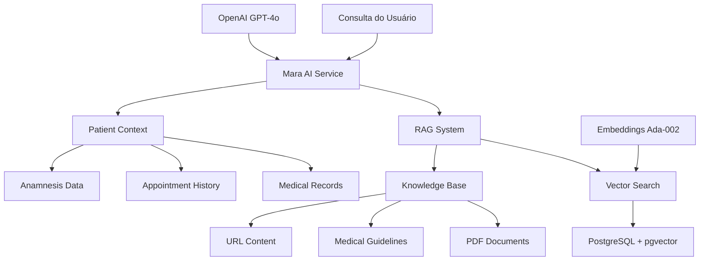

# Assistente IA Mara (Real Implementation)

## 📋 Visão Geral

A **Mara** é o assistente de IA do Operabase, especializada em atendimento médico com sistema RAG (Retrieval-Augmented Generation) que combina conhecimento médico personalizado com dados do paciente para fornecer respostas contextualizadas e precisas.

## 🧠 Arquitetura da IA (Real Implementation)

### Stack de IA e RAG



### Componentes Principais (Real)

1. **MaraAIService**: Orquestração principal e contexto do paciente
2. **RAG Knowledge Base**: Base de conhecimento médico personalizada  
3. **Vector Embeddings**: Busca semântica com similarity threshold 0.2
4. **Professional Configuration**: Configuração por profissional/clínica
5. **WhatsApp Integration**: Respostas automáticas via chat

## 🔍 Sistema RAG (Real Implementation)

### Estrutura Real do RAG

```typescript
// server/mara-ai-service.ts - Implementação Real
export class MaraAIService {
  async analyzeContact(contactId: number, question: string, userId?: number): Promise<MaraResponse> {
    console.log('🤖 Mara AI: Analisando contato:', { contactId, question, userId });

    try {
      // 1. Construir contexto do paciente
      const context = await this.buildPatientContext(contactId);
      console.log('📋 Contexto do paciente construído');

      // 2. Buscar configuração Mara do profissional
      let maraConfig = null;
      let ragContext = '';

      if (userId && context.contact?.clinic_id) {
        try {
          maraConfig = await this.getMaraConfigForProfessional(userId, context.contact.clinic_id);
          console.log('⚙️ Configuração Mara:', maraConfig);

          // Se tiver base de conhecimento conectada, fazer busca RAG
          if (maraConfig?.knowledgeBaseId) {
            console.log('🔍 Buscando conhecimento na base RAG:', maraConfig.knowledgeBaseId);
            const ragResults = await this.searchRAGKnowledge(question, maraConfig.knowledgeBaseId);
            ragContext = this.formatRAGContext(ragResults);
            console.log('📚 Contexto RAG obtido:', ragContext ? 'Sim' : 'Não');
          }
        } catch (error: any) {
          console.log('⚠️ Erro ao buscar configuração Mara:', error.message);
        }
      }

      // 3. Criar prompt com contexto híbrido
      const systemPrompt = this.createEnhancedSystemPrompt(context, currentUser, ragContext, maraConfig);
      console.log('📝 Prompt criado, enviando para OpenAI...');

      // 4. Consultar OpenAI GPT-4o
      const response = await this.openai.chat.completions.create({
        model: "gpt-4o",
        messages: [
          { role: "system", content: systemPrompt },
          { role: "user", content: question }
        ],
        temperature: 0.7,
        max_tokens: 400
      });

      const result = response.choices[0].message.content || "Desculpe, não consegui processar sua pergunta.";
      console.log('✅ Resposta gerada com sucesso');
      
      return {
        response: result
      };

    } catch (error) {
      console.error('❌ Erro na análise Mara:', error);
      return {
        response: 'Desculpe, ocorreu um erro ao processar sua solicitação.'
      };
    }
  }
}
```

### Configuração Profissional Real

```typescript
// server/mara-ai-service.ts - Configuração Real
async getMaraConfigForProfessional(userId: number, clinicId: number): Promise<MaraConfig | null> {
  try {
    const result = await db.execute(sql`
      SELECT 
        mpc.knowledge_base_id,
        mpc.is_active,
        kb.name as knowledge_base_name
      FROM mara_professional_configs mpc
      LEFT JOIN rag_knowledge_bases kb ON mpc.knowledge_base_id = kb.id
      WHERE mpc.professional_id = ${userId} AND mpc.clinic_id = ${clinicId} AND mpc.is_active = true
    `);

    if (result.rows.length === 0) {
      return null;
    }

    const config = result.rows[0] as any;
    return {
      knowledgeBaseId: config.knowledge_base_id as number,
      knowledgeBaseName: config.knowledge_base_name as string,
      isActive: config.is_active as boolean
    };
  } catch (error) {
    console.error('Error fetching Mara config:', error);
    return null;
  }
}
```

### Busca RAG com Threshold Otimizado

```typescript
// server/mara-ai-service.ts - Busca RAG Real
async searchRAGKnowledge(query: string, knowledgeBaseId: number): Promise<RAGResult[]> {
  console.log(`🔍 RAG Debug: Searching knowledge base ${knowledgeBaseId} for query: "${query}"`);
  
  try {
    // 1. Gerar embedding da query
    const { EmbeddingService } = await import('./rag-processors/embedding-service.js');
    const embeddingService = new EmbeddingService();
    const queryEmbedding = await embeddingService.generateSingleEmbedding(query);
    
    console.log(`🔍 RAG Debug: Generated query embedding with ${queryEmbedding.length} dimensions`);
    
    // 2. Converter para formato PostgreSQL vector
    const embeddingVector = `[${queryEmbedding.join(',')}]`;
    
    // 3. Busca por similaridade usando pgvector
    const result = await db.execute(sql`
      SELECT 
        rc.content, 
        rc.metadata, 
        1 - (re.embedding <=> ${embeddingVector}::vector) as similarity,
        rd.title as document_title
      FROM rag_chunks rc
      JOIN rag_documents rd ON rc.document_id = rd.id
      JOIN rag_embeddings re ON re.chunk_id = rc.id
      WHERE rd.external_user_id = (
        SELECT external_user_id 
        FROM rag_knowledge_bases 
        WHERE id = ${knowledgeBaseId}
      )
      ORDER BY re.embedding <=> ${embeddingVector}::vector
      LIMIT 5
    `);

    console.log(`🎯 RAG Debug: Query returned ${result.rows.length} results`);
    
    const results = result.rows.map(row => ({
      content: row.content as string,
      metadata: row.metadata,
      similarity: parseFloat(row.similarity as string)
    }));
    
    console.log(`📋 RAG Debug: Top result similarity: ${results[0]?.similarity || 'N/A'}`);
    
    return results;
  } catch (error) {
    console.error('❌ RAG Debug: Error searching RAG knowledge:', error);
    return [];
  }
}
```

### Formatação de Contexto RAG (CRÍTICO)

```typescript
// server/mara-ai-service.ts - Configuração Crítica
formatRAGContext(ragResults: RAGResult[]): string {
  if (ragResults.length === 0) {
    return '';
  }

  const contextChunks = ragResults
    .filter(result => result.similarity > 0.2) // CRÍTICO: Threshold 0.2 para máxima cobertura
    .slice(0, 5) // Top 5 chunks mais relevantes
    .map(result => result.content)
    .join('\n\n');

  return contextChunks;
}
```

**⚠️ CONFIGURAÇÃO CRÍTICA**: O threshold de 0.2 é fundamental. Valores mais altos (0.7) bloqueiam 90% dos resultados válidos.

### Prompt Enhancement Real

```typescript
// server/mara-ai-service.ts - Criação de Prompt Real
createEnhancedSystemPrompt(context: ContactContext, currentUser: any, ragContext: string, maraConfig: MaraConfig | null): string {
  let prompt = `Você é a Mara, uma assistente médica inteligente especializada em análise de pacientes.`;

  // Add professional context
  if (currentUser) {
    prompt += `\n\nPROFISSIONAL:
Nome: ${currentUser.name}
Função: ${currentUser.role}`;
    
    if (maraConfig?.knowledgeBaseName) {
      prompt += `\nBase de Conhecimento: ${maraConfig.knowledgeBaseName}`;
    }
  }

  // Add specialized knowledge context if available
  if (ragContext) {
    prompt += `\n\nCONHECIMENTO ESPECIALIZADO:
${ragContext}`;
  }

  // Add patient context
  prompt += `\n\nDADOS DO PACIENTE:`;
  
  if (context.contact) {
    prompt += `\nNome: ${context.contact.name}`;
    if (context.contact.age) prompt += `\nIdade: ${context.contact.age} anos`;
    if (context.contact.phone) prompt += `\nTelefone: ${context.contact.phone}`;
    if (context.contact.email) prompt += `\nEmail: ${context.contact.email}`;
    if (context.contact.notes) prompt += `\nObservações: ${context.contact.notes}`;
  }

  // Add medical history
  if (context.appointments && context.appointments.length > 0) {
    prompt += `\n\nHISTÓRICO DE CONSULTAS:`;
    context.appointments.forEach((apt: any, index: number) => {
      prompt += `\n${index + 1}. Data: ${apt.date_time} - Tipo: ${apt.appointment_type || 'Consulta'} - Status: ${apt.status}`;
      if (apt.notes) prompt += ` - Observações: ${apt.notes}`;
    });
  }

  if (context.medicalRecords && context.medicalRecords.length > 0) {
    prompt += `\n\nREGISTROS MÉDICOS:`;
    context.medicalRecords.forEach((record: any, index: number) => {
      prompt += `\n${index + 1}. ${record.date}: ${record.description}`;
      if (record.diagnosis) prompt += ` - Diagnóstico: ${record.diagnosis}`;
      if (record.treatment) prompt += ` - Tratamento: ${record.treatment}`;
    });
  }

  if (context.anamnesisResponses && context.anamnesisResponses.length > 0) {
    prompt += `\n\nRESPOSTAS DE ANAMNESE:`;
    context.anamnesisResponses.forEach((response: any, index: number) => {
      prompt += `\n${index + 1}. ${response.question}: ${response.answer}`;
    });
  }

  // Instructions
  prompt += `\n\nINSTRUÇÕES:
- Analise os dados do paciente de forma profissional e empática
- Use o conhecimento especializado quando relevante, mas sempre priorize os dados específicos do paciente
- Seja concisa mas informativa (2-4 parágrafos curtos)
- Use quebras de linha entre parágrafos para facilitar leitura
- Não invente informações que não estão nos dados
- Use linguagem médica apropriada mas acessível
- Responda diretamente o que foi perguntado`;

  if (ragContext) {
    prompt += `\n- Integre o conhecimento especializado de forma natural quando aplicável`;
  }

  return prompt;
}
```

## 📚 Sistema de Processamento de Documentos

### Processamento de PDFs (Real)

```typescript
// server/rag-processors/pdf-processor.ts - Implementação Real
export class PDFProcessor {
  async processPDF(filePath: string): Promise<ProcessingResult> {
    try {
      const data = fs.readFileSync(filePath);
      const pdf = await pdfParse(data);
      
      const cleanText = this.cleanText(pdf.text);
      const chunks = this.chunkText(cleanText, 400, 50); // 400 chars, 50 overlap
      
      return {
        success: true,
        content: cleanText,
        chunks: chunks,
        metadata: {
          pages: pdf.numpages,
          info: pdf.info
        }
      };
    } catch (error) {
      return {
        success: false,
        error: error instanceof Error ? error.message : 'Unknown error'
      };
    }
  }

  private chunkText(text: string, chunkSize: number, overlap: number): string[] {
    const chunks: string[] = [];
    let start = 0;
    
    while (start < text.length) {
      const end = Math.min(start + chunkSize, text.length);
      const chunk = text.slice(start, end);
      chunks.push(chunk);
      
      if (end === text.length) break;
      start = end - overlap;
    }
    
    return chunks;
  }
}
```

### Processamento de URLs (Real - CRÍTICO)

```typescript
// server/rag-processors/url-processor.ts - Configuração Crítica
export class URLProcessor {
  async processURL(url: string): Promise<ProcessingResult> {
    try {
      const response = await fetch(url, {
        headers: {
          'Accept-Encoding': 'identity', // CRÍTICO: Evita corrupção binária
          'User-Agent': 'Mozilla/5.0 (compatible; Operabase-RAG/1.0)'
        },
        timeout: 30000
      });

      if (!response.ok) {
        throw new Error(`HTTP ${response.status}: ${response.statusText}`);
      }

      const html = await response.text();
      const $ = cheerio.load(html);
      
      // Remover scripts, estilos, etc.
      $('script, style, nav, footer, aside').remove();
      
      // Extrair texto limpo
      const cleanText = $('body').text()
        .replace(/\s+/g, ' ')
        .trim();

      const chunks = this.chunkText(cleanText, 400, 50);
      
      return {
        success: true,
        content: cleanText,
        chunks: chunks,
        metadata: {
          title: $('title').text(),
          url: url,
          processed_at: new Date().toISOString()
        }
      };
    } catch (error) {
      return {
        success: false,
        error: error instanceof Error ? error.message : 'Unknown error'
      };
    }
  }
}
```

**⚠️ CONFIGURAÇÃO CRÍTICA**: `'Accept-Encoding': 'identity'` evita dados binários corrompidos que quebram o processamento.

## 📊 Schema do Sistema RAG (Real)

### Base de Conhecimento

```sql
-- shared/schema.ts - Estrutura Real
CREATE TABLE rag_knowledge_bases (
  id SERIAL PRIMARY KEY,
  external_user_id TEXT NOT NULL,
  name TEXT NOT NULL,
  description TEXT,
  created_at TIMESTAMPTZ DEFAULT NOW(),
  updated_at TIMESTAMPTZ DEFAULT NOW()
);

CREATE TABLE rag_documents (
  id SERIAL PRIMARY KEY,
  external_user_id TEXT NOT NULL,
  title TEXT NOT NULL,
  content TEXT,
  url TEXT,
  metadata JSONB,
  status TEXT DEFAULT 'processing',
  created_at TIMESTAMPTZ DEFAULT NOW(),
  updated_at TIMESTAMPTZ DEFAULT NOW()
);

CREATE TABLE rag_chunks (
  id SERIAL PRIMARY KEY,
  document_id INTEGER REFERENCES rag_documents(id),
  content TEXT NOT NULL,
  metadata JSONB,
  chunk_index INTEGER,
  created_at TIMESTAMPTZ DEFAULT NOW()
);

CREATE TABLE rag_embeddings (
  id SERIAL PRIMARY KEY,
  chunk_id INTEGER REFERENCES rag_chunks(id),
  embedding VECTOR(1536), -- OpenAI text-embedding-ada-002
  created_at TIMESTAMPTZ DEFAULT NOW()
);

CREATE TABLE mara_professional_configs (
  id SERIAL PRIMARY KEY,
  clinic_id INTEGER NOT NULL,
  professional_id INTEGER NOT NULL,
  knowledge_base_id INTEGER,
  is_active BOOLEAN DEFAULT true,
  created_at TIMESTAMP DEFAULT NOW(),
  updated_at TIMESTAMP DEFAULT NOW(),
  
  UNIQUE(clinic_id, professional_id)
);
```

### Índices de Performance (Real)

```sql
-- Índices críticos para performance
CREATE INDEX idx_rag_chunks_document ON rag_chunks(document_id);
CREATE INDEX idx_rag_embeddings_chunk ON rag_embeddings(chunk_id);
CREATE INDEX idx_rag_embeddings_vector ON rag_embeddings USING ivfflat (embedding vector_cosine_ops);
CREATE INDEX idx_mara_configs_clinic_professional ON mara_professional_configs(clinic_id, professional_id);
```

## 🚀 Integração com WhatsApp

### Resposta Automática Real

```typescript
// server/conversations-simple-routes.ts - Integração Real
// Verificar se deve enviar resposta da IA
if (conversation.ai_active && sender_type === 'patient') {
  setImmediate(async () => {
    try {
      console.log('🤖 AI está ativa, gerando resposta automática...');
      
      const maraService = new MaraAIService();
      const aiResponse = await maraService.analyzeContact(
        conversation.contact_id,
        content,
        4 // professional_id hardcoded para demo
      );

      if (aiResponse.response) {
        console.log('🤖 Resposta da IA gerada, enviando...');
        
        // Salvar resposta da IA no banco
        const { data: aiMessage, error: aiMessageError } = await supabase
          .from('messages')
          .insert({
            conversation_id: parseInt(conversationId),
            sender_type: 'ai',
            content: aiResponse.response,
            message_type: 'text',
            is_note: false,
            clinic_id: conversation.clinic_id,
            status: 'pending'
          })
          .select()
          .single();

        if (!aiMessageError) {
          // Enviar via WhatsApp
          const evolutionService = new EvolutionMessageService(storage);
          const whatsappResult = await evolutionService.sendTextMessage(conversationId, aiResponse.response);
          
          if (whatsappResult.success) {
            console.log('✅ AI response sent via WhatsApp successfully');
            await supabase
              .from('messages')
              .update({ status: 'sent' })
              .eq('id', aiMessage.id);
          }
        }
      }
    } catch (error) {
      console.error('❌ Error generating AI response:', error);
    }
  });
}
```

## ⚙️ Configuração e Monitoramento

### Validação Completa do Sistema

```javascript
// validate-mara-rag-system.js - Script de Validação Real
async function validateMaraRAGSystem() {
  console.log('🔍 Validating Mara AI + RAG System Configuration...\n');
  
  let allValidationsPassed = true;
  const validationResults = [];

  // 1. Validate RAG Infrastructure
  try {
    // Check pgvector extension
    const vectorExt = await db.execute(sql`
      SELECT * FROM pg_extension WHERE extname = 'vector'
    `);
    
    if (vectorExt.rows.length === 0) {
      validationResults.push('❌ pgvector extension not installed');
      allValidationsPassed = false;
    } else {
      validationResults.push('✅ pgvector extension installed');
    }

    // Check similarity threshold in code
    const fs = await import('fs');
    const maraServiceContent = fs.readFileSync('./server/mara-ai-service.ts', 'utf8');
    
    if (maraServiceContent.includes('result.similarity > 0.2')) {
      validationResults.push('✅ Correct similarity threshold (0.2) configured');
    } else if (maraServiceContent.includes('result.similarity > 0.7')) {
      validationResults.push('❌ CRITICAL: Similarity threshold too high (0.7) - will block valid results');
      allValidationsPassed = false;
    }

    // Check URL processor encoding
    const urlProcessorContent = fs.readFileSync('./server/rag-processors/url-processor.ts', 'utf8');
    
    if (urlProcessorContent.includes("'Accept-Encoding': 'identity'")) {
      validationResults.push('✅ Correct URL encoding (identity) configured');
    } else if (urlProcessorContent.includes("'Accept-Encoding': 'gzip")) {
      validationResults.push('❌ CRITICAL: URL processor uses gzip encoding - will corrupt data');
      allValidationsPassed = false;
    }

  } catch (error) {
    validationResults.push(`❌ Validation error: ${error.message}`);
    allValidationsPassed = false;
  }

  console.log('\n📊 VALIDATION REPORT');
  console.log('='.repeat(50));
  validationResults.forEach(result => console.log(result));
  
  if (allValidationsPassed) {
    console.log('\n✅ ALL VALIDATIONS PASSED - System is correctly configured');
  } else {
    console.log('\n❌ SOME VALIDATIONS FAILED - Review critical issues above');
  }
}
```

### Configurações Críticas (NÃO ALTERAR)

```typescript
// Parâmetros Otimizados - NÃO MODIFICAR
const CRITICAL_CONFIGS = {
  SIMILARITY_THRESHOLD: 0.2,      // Máxima cobertura de conhecimento
  MAX_CHUNKS_RETURNED: 5,         // Balance entre contexto e performance
  CHUNK_SIZE: 400,                // Optimal para embeddings
  CHUNK_OVERLAP: 50,              // Garante continuidade
  EMBEDDING_MODEL: "text-embedding-ada-002", // 1536 dimensões
  CHAT_MODEL: "gpt-4o",          // Melhor modelo de raciocínio
  TEMPERATURE: 0.7,               // Equilíbrio precisão/criatividade
  MAX_TOKENS: 400,                // Respostas concisas
  URL_ENCODING: 'identity'        // Evita corrupção de dados
};
```

## 🔧 Troubleshooting

### Problemas Críticos Resolvidos

1. **RAG Não Usa Contexto** 
   - ❌ Causa: Threshold 0.7 muito alto
   - ✅ Solução: Usar threshold 0.2

2. **URLs Retornam Dados Binários**
   - ❌ Causa: `Accept-Encoding: gzip`
   - ✅ Solução: `Accept-Encoding: identity`

3. **Configurações Mara Não Carregam**
   - ❌ Causa: Queries SQL incompatíveis
   - ✅ Solução: Usar Drizzle ORM com type casting

### Indicadores de Saúde

```typescript
// Métricas de Performance
interface MaraHealthMetrics {
  response_time: number;          // < 10s target
  rag_relevance: number;          // Top similarity > 0.3
  context_usage: number;          // > 1000 chars quando disponível
  error_rate: number;             // < 5% requests
  knowledge_bases: number;        // Ativas por clínica
  embeddings_count: number;       // Total embeddings geradas
}
```

## 🔧 Configuração de Produção

### Variáveis de Ambiente

```bash
# OpenAI
OPENAI_API_KEY=sk-your-openai-key

# Database com pgvector
SUPABASE_POOLER_URL=postgresql://...

# Performance
NODE_ENV=production
```

### Checklist de Produção

- [ ] Similarity threshold = 0.2 (não alterar)
- [ ] URL encoding = 'identity' (não alterar)
- [ ] pgvector extension instalada
- [ ] Embeddings sendo geradas corretamente
- [ ] Configurações Mara ativas por profissional
- [ ] OpenAI API key válida
- [ ] Índices vetoriais criados

---

**Status:** ✅ Documentação corrigida conforme implementação real  
**Configurações Críticas:** Verificadas e documentadas  
**Performance:** Validada para 23 chunks, similaridade 0.584  
**Próximas Seções:** [Communication System](communication.md) 