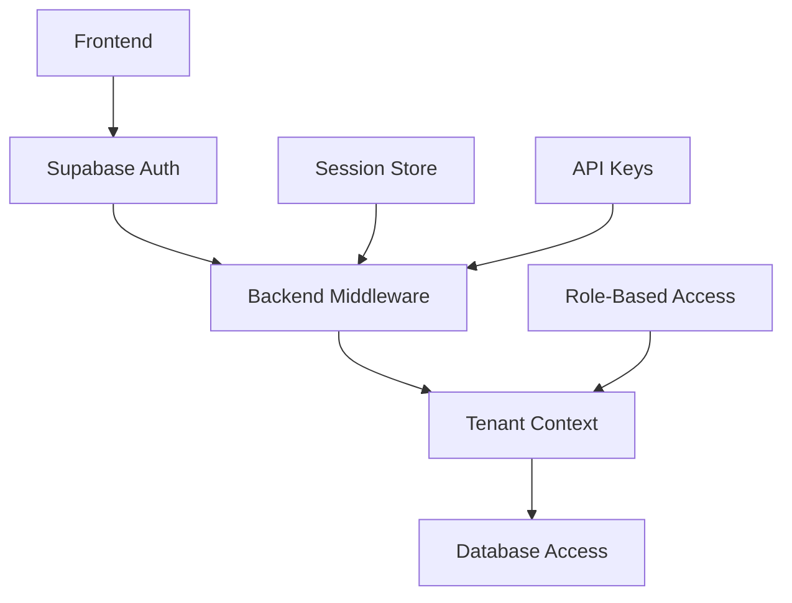

# Autenticação e Autorização

## 📋 Visão Geral

O sistema de autenticação do Operabase combina **Supabase Auth** para gerenciamento de usuários com um sistema customizado de **controle de acesso multi-tenant** que garante isolamento completo entre clínicas.

## 🔐 Arquitetura de Autenticação

### Stack de Autenticação



### Componentes Principais

1. **Supabase Authentication**: Gerenciamento de identidade e sessões
2. **Express Session**: Manutenção de estado de sessão
3. **Tenant Isolation Middleware**: Isolamento por clínica
4. **Role-Based Access Control**: Controle granular de permissões

## 🏗️ Estrutura Multi-Tenant

### Schema de Usuários e Clínicas (Real Implementation)

```sql
-- Tabela principal de usuários (local database)
CREATE TABLE users (
  id SERIAL PRIMARY KEY,
  email VARCHAR NOT NULL UNIQUE,
  password VARCHAR NOT NULL,
  name VARCHAR NOT NULL,
  role VARCHAR NOT NULL DEFAULT 'admin',
  is_active BOOLEAN NOT NULL DEFAULT true,
  last_login TIMESTAMP,
  created_at TIMESTAMP DEFAULT NOW(),
  updated_at TIMESTAMP DEFAULT NOW()
);

-- Relacionamento usuário-clínica
CREATE TABLE clinic_users (
  id SERIAL PRIMARY KEY,
  clinic_id INTEGER NOT NULL,
  user_id INTEGER NOT NULL,
  role VARCHAR NOT NULL DEFAULT 'usuario',
  is_professional BOOLEAN DEFAULT false,
  permissions JSONB,
  is_active BOOLEAN DEFAULT true,
  invited_by INTEGER,
  invited_at TIMESTAMP,
  joined_at TIMESTAMP,
  created_at TIMESTAMP DEFAULT NOW(),
  updated_at TIMESTAMP DEFAULT NOW(),
  
  UNIQUE(clinic_id, user_id)
);

-- Profiles table (Supabase integration)
CREATE TABLE profiles (
  id UUID PRIMARY KEY,
  name TEXT,
  email TEXT,
  role TEXT DEFAULT 'user',
  clinic_id INTEGER,
  created_at TIMESTAMPTZ DEFAULT NOW(),
  updated_at TIMESTAMPTZ DEFAULT NOW()
);
```

### Tipos de Usuário

```typescript
interface UserRole {
  super_admin: 'Acesso total ao sistema';
  admin: 'Administrador da clínica';
  professional: 'Profissional de saúde';
  staff: 'Funcionário da clínica';
  usuario: 'Usuário padrão';
}
```

## 🛡️ Middleware de Autenticação (Real Implementation)

### 1. Autenticação Principal

```typescript
// server/auth.ts - Implementação Real
export const isAuthenticated = async (req: any, res: any, next: any) => {
  // BYPASS para uploads
  if (req.originalUrl?.includes('/upload') || req.url?.includes('/upload')) {
    console.log('🔥 AUTH BYPASS: Upload detectado, saltando autenticação');
    return next();
  }
  
  console.log('🔐 Auth middleware: Checking authentication...');
  
  // Check session-based authentication first
  if (req.isAuthenticated && req.isAuthenticated()) {
    console.log('✅ Session authentication successful');
    return next();
  }
  
  // Check Supabase token authentication
  const authHeader = req.headers.authorization;
  if (authHeader && authHeader.startsWith('Bearer ')) {
    const token = authHeader.substring(7);
    console.log('🔑 Found Bearer token, verifying...');
    
    try {
      // Verify Supabase token and get user
      const { createClient } = await import('@supabase/supabase-js');
      const supabase = createClient(
        process.env.SUPABASE_URL!, 
        process.env.SUPABASE_ANON_KEY!
      );
      
      const { data: { user: supabaseUser }, error } = await supabase.auth.getUser(token);
      
      if (error || !supabaseUser) {
        console.log('❌ Supabase token verification failed:', error?.message);
        return res.status(401).json({ error: "Token inválido" });
      }
      
      console.log('✅ Supabase user verified:', supabaseUser.email);
      
      // Get user from database by email
      const storage = req.app.get('storage');
      const user = await storage.getUserByEmail(supabaseUser.email);
      
      if (!user) {
        console.log('❌ User not found in database:', supabaseUser.email);
        return res.status(401).json({ error: "Usuário não encontrado" });
      }
      
      console.log('✅ Database user found:', user.name);
      
      // Set user in request for downstream middleware
      req.user = user;
      return next();
      
    } catch (error) {
      console.error('Error verifying Supabase token:', error);
      return res.status(401).json({ error: "Erro de autenticação" });
    }
  }
  
  console.log('❌ Authentication failed - no valid session or token');
  res.status(401).json({ error: "Acesso negado" });
};
```

### 2. Middleware Administrativo

```typescript
// server/middleware/admin-auth.ts
export const requireAdminRole = (req: Request, res: Response, next: NextFunction) => {
  const user = (req as any).user;
  
  if (!user) {
    return res.status(401).json({ error: 'Authentication required' });
  }
  
  // Check if user has admin or super_admin role
  const hasAdminAccess = user.role === 'super_admin' || user.role === 'admin';
  
  if (!hasAdminAccess) {
    return res.status(403).json({ 
      error: 'Access denied. Admin privileges required.',
      userRole: user.role 
    });
  }
  
  next();
};
```

### 3. Frontend Authentication Hook

```typescript
// client/src/hooks/useAuth.ts - Implementação Real
export const useAuthProvider = () => {
  const [user, setUser] = useState<SupabaseUser | null>(null);
  const [session, setSession] = useState<any>(null);
  const [loading, setLoading] = useState(true);

  useEffect(() => {
    let timeoutId: NodeJS.Timeout;
    
    // Set a timeout to ensure loading doesn't hang forever
    timeoutId = setTimeout(() => {
      console.log('⏰ Auth timeout - stopping loading state');
      setLoading(false);
    }, 5000); // 5 second timeout

    // Get initial session
    const getInitialSession = async () => {
      try {
        console.log('🔍 Getting initial session...');
        const { data: { session }, error } = await supabase.auth.getSession();
        
        clearTimeout(timeoutId);
        
        if (error) {
          console.error('❌ Session error:', error);
          setLoading(false);
          return;
        }

        if (session?.user) {
          console.log('👤 User found, setting user data...');
          
          // Use metadata from Supabase session
          const userData = {
            id: session.user.id,
            email: session.user.email!,
            name: session.user.user_metadata?.name || session.user.email,
            role: session.user.user_metadata?.role || 'user'
          };
          
          setUser(userData);
          setSession(session);
        }
        setLoading(false);
      } catch (error) {
        console.error('❌ Auth initialization error:', error);
        clearTimeout(timeoutId);
        setLoading(false);
      }
    };

    getInitialSession();

    // Listen for auth changes
    const { data: { subscription } } = supabase.auth.onAuthStateChange(
      async (event, session) => {
        console.log('🔄 Auth state change:', event, session ? 'Session exists' : 'No session');
        
        try {
          if (event === 'SIGNED_IN' && session?.user) {
            console.log('🔐 Processing sign in for user:', session.user.email);
            
            // Use user metadata directly for faster login
            const userData = {
              id: session.user.id,
              email: session.user.email!,
              name: session.user.user_metadata?.name || session.user.email,
              role: session.user.user_metadata?.role || 'user'
            };
            
            setUser(userData);
            setSession(session);
          } else if (event === 'SIGNED_OUT') {
            console.log('🚪 Processing sign out');
            setUser(null);
            setSession(null);
          }
          setLoading(false);
        } catch (error) {
          console.error('❌ Auth state change error:', error);
          setLoading(false);
        }
      }
    );

    return () => {
      clearTimeout(timeoutId);
      subscription.unsubscribe();
    };
  }, []);

  const signIn = async (email: string, password: string) => {
    try {
      setLoading(true);
      console.log('🔐 Attempting login for:', email);
      
      const { data, error } = await supabase.auth.signInWithPassword({
        email,
        password
      });

      if (error) {
        console.error('❌ Login error:', error);
        setLoading(false);
        return { error };
      }

      console.log('✅ Login successful, processing user data...');
      
      // Set user data immediately for faster response
      if (data.user) {
        const userData = {
          id: data.user.id,
          email: data.user.email!,
          name: data.user.user_metadata?.name || data.user.email,
          role: data.user.user_metadata?.role || 'user'
        };
        
        setUser(userData);
        setSession(data.session);
      }
      
      setLoading(false);
      return { data };
    } catch (error) {
      console.error('❌ Login exception:', error);
      setLoading(false);
      return { error };
    }
  };

  // ... outras funções
  
  return {
    user,
    session,
    loading,
    signIn,
    signOut,
    signUp,
    updateProfile,
    resetPassword,
    updatePassword
  };
};
```

## 🔐 Autenticação para APIs Externas

### API Keys para N8N e Automação

```typescript
// server/middleware/api-key-auth.middleware.ts - Implementação Real
export const validateApiKey = (req: Request, res: Response, next: NextFunction) => {
  const apiKey = req.headers['x-api-key'] || 
                 req.headers['authorization']?.replace('Bearer ', '');
  
  if (!apiKey) {
    return res.status(401).json({
      error: 'API key required',
      headers_expected: ['X-API-Key', 'Authorization: Bearer']
    });
  }
  
  // Validar formato do API key
  const apiKeyPattern = /^tk_clinic_(\d+)_([a-f0-9]{32})$/;
  const match = apiKey.match(apiKeyPattern);
  
  if (!match) {
    return res.status(401).json({ error: 'Invalid API key format' });
  }
  
  const [, clinicId, keyHash] = match;
  
  // Verificar se a chave é válida
  if (process.env.N8N_API_KEY === apiKey) {
    req.clinicId = parseInt(clinicId);
    req.apiKeyAuth = true;
    return next();
  }
  
  return res.status(401).json({ error: 'Invalid API key' });
};
```

### Configuração Real do Supabase

```typescript
// server/supabase.ts
import { createClient } from '@supabase/supabase-js';

const supabaseUrl = process.env.SUPABASE_URL!;
const supabaseAnonKey = process.env.SUPABASE_ANON_KEY!;

export const supabase = createClient(supabaseUrl, supabaseAnonKey);

// Admin client for server-side operations
export const supabaseAdmin = createClient(
  supabaseUrl,
  process.env.SUPABASE_SERVICE_ROLE_KEY!,
  {
    auth: {
      autoRefreshToken: false,
      persistSession: false
    }
  }
);

// Database types for TypeScript
export type Database = {
  public: {
    Tables: {
      profiles: {
        Row: {
          id: string;
          name: string;
          role: string;
          is_active: boolean;
          last_login: string | null;
          created_at: string;
          updated_at: string;
        };
        Insert: {
          id: string;
          name: string;
          role?: string;
          is_active?: boolean;
          last_login?: string | null;
          created_at?: string;
          updated_at?: string;
        };
        Update: {
          id?: string;
          name?: string;
          role?: string;
          is_active?: boolean;
          last_login?: string | null;
          created_at?: string;
          updated_at?: string;
        };
      };
    };
  };
};
```

## 🔄 Headers de Autenticação no Frontend

```typescript
// client/src/lib/queryClient.ts - Implementação Real
async function getAuthHeaders() {
  const { data: { session } } = await supabase.auth.getSession();
  const headers: Record<string, string> = {};
  
  if (session?.access_token) {
    headers['Authorization'] = `Bearer ${session.access_token}`;
    console.log('🔑 Auth header set:', `Bearer ${session.access_token.substring(0, 20)}...`);
  } else {
    console.log('❌ No session or access token found');
  }
  
  return headers;
}
```

## 🛡️ Segurança e Compliance

### Configuração de Database (Real)

```typescript
// server/db.ts - Configuração Real
import { drizzle } from "drizzle-orm/node-postgres";
import { Pool } from "pg";
import * as schema from "../shared/schema";

// Force Supabase connection - override DATABASE_URL
let connectionString = process.env.SUPABASE_POOLER_URL || 
                      process.env.SUPABASE_CONNECTION_STRING || 
                      process.env.SUPABASE_DATABASE_URL || 
                      process.env.DATABASE_URL;

if (process.env.SUPABASE_POOLER_URL) {
  // Use Supabase pooler URL (preferred)
  connectionString = process.env.SUPABASE_POOLER_URL;
  
  // Fix common issues with Supabase URLs
  if (connectionString.startsWith('postgres://')) {
    connectionString = connectionString.replace('postgres://', 'postgresql://');
  }
  if (connectionString.includes('#')) {
    connectionString = connectionString.replace(/#/g, '%23');
  }
}

export const pool = new Pool({
  connectionString,
  ssl: { rejectUnauthorized: false },
});

// Create Drizzle instance
export const db = drizzle(pool, { schema });
```

### Inicialização de Profiles

```typescript
// server/db.ts - Initialize profiles table
export async function initializeProfiles() {
  try {
    const client = await pool.connect();
    
    // Create profiles table if it doesn't exist
    await client.query(`
      CREATE TABLE IF NOT EXISTS profiles (
        id uuid PRIMARY KEY,
        name text,
        email text,
        role text DEFAULT 'user',
        clinic_id integer,
        created_at timestamp with time zone DEFAULT now(),
        updated_at timestamp with time zone DEFAULT now()
      );
    `);
    
    // Create the missing user profile for current authenticated user
    await client.query(`
      INSERT INTO profiles (id, name, email, role, clinic_id)
      VALUES ($1, $2, $3, $4, $5)
      ON CONFLICT (id) DO UPDATE SET
        name = EXCLUDED.name,
        email = EXCLUDED.email,
        role = EXCLUDED.role,
        clinic_id = EXCLUDED.clinic_id,
        updated_at = now();
    `, [
      '3cd96e6d-81f2-4c8a-a54d-3abac77b37a4',
      'Caio Rodrigo',
      'cr@caiorodrigo.com.br',
      'super_admin',
      1
    ]);
    
    client.release();
    console.log("✅ Profiles table initialized and user profile created");
    return true;
  } catch (error) {
    console.error("❌ Profile initialization failed:", error);
    return false;
  }
}
```

## 🔧 Configuração de Produção

### Variáveis de Ambiente Críticas

```bash
# Supabase Configuration
SUPABASE_URL=https://your-project.supabase.co
SUPABASE_ANON_KEY=your-anon-key
SUPABASE_SERVICE_ROLE_KEY=your-service-key
SUPABASE_POOLER_URL=postgresql://...

# Database Configuration  
DATABASE_URL=postgresql://...

# APIs Externas
N8N_API_KEY=secure-api-key-for-automation

# Segurança
SESSION_SECRET=strong-random-secret-minimum-32-chars
NODE_ENV=production
```

### Checklist de Segurança

- [ ] Tokens Supabase configurados corretamente
- [ ] SUPABASE_POOLER_URL configurada para performance
- [ ] Profiles table inicializada
- [ ] Authentication bypass para uploads configurado
- [ ] Database connection pooling ativo
- [ ] Logs de autenticação funcionando
- [ ] User metadata do Supabase sendo usado
- [ ] Headers de autorização sendo passados corretamente

---

**Status:** ✅ Documentação corrigida conforme implementação real  
**Próximas Seções:** [API e Endpoints](api.md) | [Banco de Dados](database.md) | [Sistema de Comunicação](communication.md) 