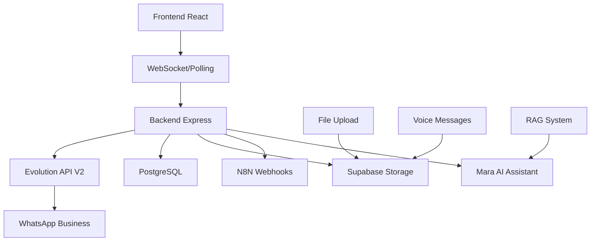
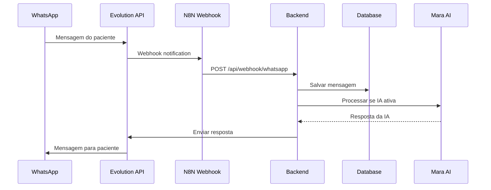
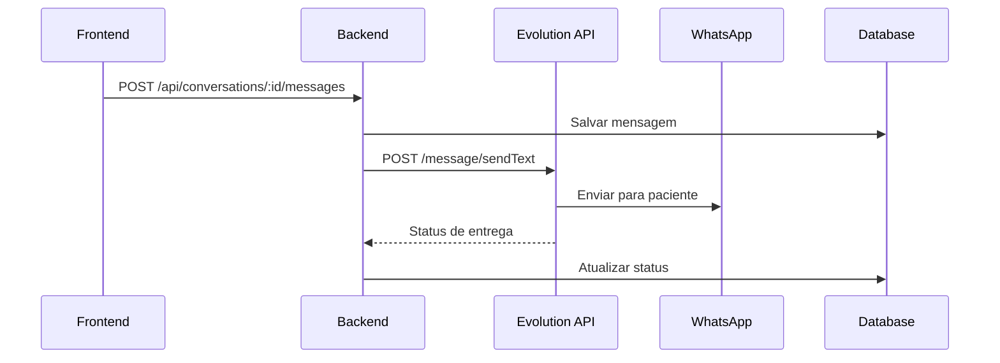
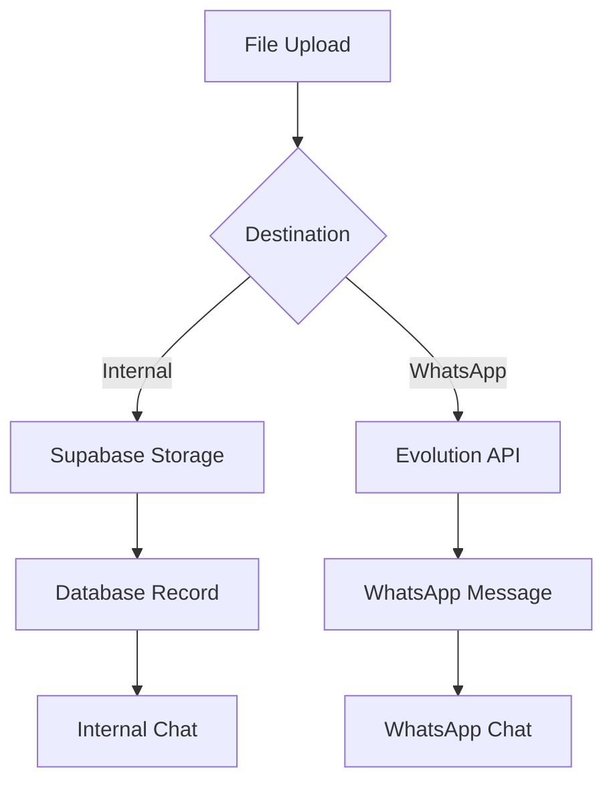

# Sistema de Comunicação

## 📋 Visão Geral

O sistema de comunicação do Operabase integra **WhatsApp Evolution API V2** com uma interface web unificada, permitindo comunicação em tempo real entre clínicas e pacientes através de múltiplos canais com suporte a IA.

## 🏗️ Arquitetura de Comunicação

### Stack de Comunicação



### Componentes Principais

1. **Evolution API Integration**: Conexão com WhatsApp Business
2. **Real-time Messaging**: Interface web para conversas
3. **File Upload System**: Suporte a arquivos e áudio
4. **AI Assistant Integration**: Mara AI com RAG
5. **N8N Automation**: Webhooks para automação

## 💬 Sistema de Conversas

### Estrutura de Dados

```typescript
interface Conversation {
  id: number;
  clinic_id: number;
  contact_id: number;
  whatsapp_conversation_id: string;
  ai_active: boolean;
  ai_pause_end_time: Date | null;
  last_message_id: number;
  last_message_at: Date;
  contact: {
    name: string;
    phone: string;
    email?: string;
  };
}

interface Message {
  id: number;
  conversation_id: number;
  sender_type: 'patient' | 'professional' | 'system' | 'ai';
  content: string;
  message_type: 'text' | 'file' | 'audio_voice' | 'image' | 'document';
  whatsapp_message_id?: string;
  evolution_status?: string;
  is_note: boolean;
  attachments?: any[];
  metadata?: any;
  created_at: Date;
}
```

### Fluxos de Mensagem

#### 1. Mensagem do Paciente (WhatsApp → Sistema)



#### 2. Mensagem do Profissional (Sistema → WhatsApp)



## 📱 Integração WhatsApp

### Evolution API V2 Configuration

```typescript
interface EvolutionAPIConfig {
  baseURL: string;
  apiKey: string;
  instance: {
    name: string;
    integration: 'WHATSAPP-BAILEYS';
    qrcode: boolean;
    webhook: {
      url: string;
      events: string[];
    };
  };
}

const evolutionConfig: EvolutionAPIConfig = {
  baseURL: process.env.EVOLUTION_API_URL,
  apiKey: process.env.EVOLUTION_API_KEY,
  instance: {
    name: `clinic_${clinicId}_user_${userId}_${timestamp}`,
    integration: 'WHATSAPP-BAILEYS',
    qrcode: true,
    webhook: {
      url: 'https://n8n.com/webhook/whatsapp',
      events: [
        'MESSAGES_UPSERT',
        'CONNECTION_UPDATE',
        'QRCODE_UPDATED'
      ]
    }
  }
};
```

### Gerenciamento de Instâncias

#### 1. Criar Nova Instância

```typescript
// server/whatsapp-evolution-service.ts
export class EvolutionApiService {
  async createInstance(instanceName: string): Promise<EvolutionApiResponse> {
    const data = {
      instanceName,
      integration: "WHATSAPP-BAILEYS",
      qrcode: true,
      rejectCall: true,
      groupsIgnore: true,
      webhook: {
        url: process.env.N8N_WEBHOOK_URL,
        events: ["MESSAGES_UPSERT", "CONNECTION_UPDATE"]
      }
    };

    return this.makeRequest('/instance/create', 'POST', data);
  }

  async fetchQRCode(instanceName: string): Promise<string> {
    const response = await this.makeRequest(`/instance/connect/${instanceName}`);
    return response.data?.base64 || response.data?.qrcode;
  }

  async deleteInstance(instanceName: string): Promise<EvolutionApiResponse> {
    return this.makeRequest(`/instance/delete/${instanceName}`, 'DELETE');
  }
}
```

#### 2. Status de Conexão

```typescript
interface WhatsAppConnection {
  id: number;
  clinic_id: number;
  phone_number: string;
  instance_name: string;
  status: 'connecting' | 'connected' | 'disconnected' | 'qr_generated';
  connected_at: Date | null;
  disconnected_at: Date | null;
  last_seen: Date;
}

// Webhook handler para status
export const handleConnectionUpdate = async (webhookData: any) => {
  const { instanceName, connectionStatus, phoneNumber } = webhookData;
  
  let status: string;
  switch (connectionStatus) {
    case 'open':
      status = 'connected';
      break;
    case 'close':
      status = 'disconnected';
      break;
    case 'connecting':
      status = 'connecting';
      break;
    default:
      status = 'disconnected';
  }

  await storage.updateWhatsAppConnectionFromWebhook(instanceName, {
    status,
    phone_number: phoneNumber,
    connected_at: status === 'connected' ? new Date() : null,
    disconnected_at: status === 'disconnected' ? new Date() : null,
    last_seen: new Date()
  });
};
```

### QR Code Management

#### 1. Geração e Timeout

```typescript
// Frontend: Timeout automático de QR Code
const QR_CODE_TIMEOUT = 90000; // 90 segundos

const handleQRTimeout = useCallback(() => {
  if (selectedQR && !isConnected) {
    console.log('⏰ QR Code expirado, limpando...');
    
    // Limpar instância não utilizada
    cleanupUnclaimedInstance(selectedQR.instanceName);
    
    // Reset UI
    setSelectedQR(null);
    setPollingEnabled(false);
    
    toast({
      title: "QR Code Expirado",
      description: "O QR Code expirou. Clique em 'Adicionar Número' para gerar um novo.",
      variant: "destructive"
    });
  }
}, [selectedQR, isConnected]);

useEffect(() => {
  if (selectedQR && !isConnected) {
    const timeoutId = setTimeout(handleQRTimeout, QR_CODE_TIMEOUT);
    return () => clearTimeout(timeoutId);
  }
}, [selectedQR, isConnected, handleQRTimeout]);
```

#### 2. Regeneração de QR Code

```typescript
// Backend: Endpoint para regenerar QR
router.post('/regenerate-qr', validateN8NApiKey, async (req, res) => {
  try {
    const { instanceName } = req.body;
    
    const whatsappNumber = await storage.getWhatsAppNumberByInstance(instanceName);
    if (!whatsappNumber) {
      return res.status(404).json({ error: 'WhatsApp instance not found' });
    }

    const qrResult = await evolutionApi.getQRCode(instanceName);
    
    if (!qrResult.success) {
      return res.status(500).json({ error: qrResult.error });
    }

    await systemLogsService.logWhatsAppAction(
      'qr_regenerated',
      whatsappNumber.id,
      whatsappNumber.clinic_id,
      undefined,
      'system',
      null,
      { instanceName, success: true },
      { source: 'qr_timeout', action: 'regenerate' }
    );

    res.json({
      success: true,
      qrCode: qrResult.data?.base64 || qrResult.data?.code,
      instanceName,
      timestamp: new Date().toISOString()
    });

  } catch (error) {
    console.error('❌ QR regeneration error:', error);
    res.status(500).json({ error: 'Failed to regenerate QR code' });
  }
});
```

## 📁 Sistema de Upload de Arquivos

### Arquitetura Dual

O sistema suporta upload tanto para o sistema interno quanto para WhatsApp:



### Upload para Sistema Interno

```typescript
// server/routes/audio-voice-clean.ts
export async function uploadVoiceMessage(
  req: any,
  res: Response,
  conversationId: string
) {
  try {
    const file = req.file;
    if (!file) {
      return res.status(400).json({ error: 'No file provided' });
    }

    // Upload para Supabase Storage
    const fileName = `voice_${Date.now()}_${file.originalname}`;
    const filePath = `clinic-${clinicId}/conversation-${conversationId}/audio/${fileName}`;
    
    const { data, error } = await supabase.storage
      .from('voice-messages')
      .upload(filePath, file.buffer, {
        contentType: file.mimetype,
        upsert: false
      });

    if (error) throw error;

    // Salvar mensagem no banco
    const message = await storage.createMessage({
      conversation_id: conversationId,
      clinic_id: clinicId,
      contact_id: contact.id,
      sender_type: 'professional',
      content: 'Mensagem de áudio',
      message_type: 'audio_voice',
      attachments: [{
        type: 'audio',
        url: data.path,
        name: fileName,
        size: file.size
      }]
    });

    res.json({
      success: true,
      data: {
        message_id: message.id,
        file_url: data.path
      }
    });

  } catch (error) {
    console.error('Error uploading voice message:', error);
    res.status(500).json({ error: 'Failed to upload voice message' });
  }
}
```

#### 2. Upload para WhatsApp

```typescript
// Envio de áudio via Evolution API
export async function sendWhatsAppAudio(
  conversationId: string,
  audioBuffer: Buffer,
  fileName: string
) {
  try {
    // Converter para base64
    const base64Audio = audioBuffer.toString('base64');
    
    // Enviar via Evolution API
    const payload = {
      number: phoneNumber,
      audio: base64Audio,
      ptt: true // Push to talk
    };

    const response = await fetch(`${EVOLUTION_BASE_URL}/message/sendWhatsAppAudio/${instanceName}`, {
      method: 'POST',
      headers: {
        'Content-Type': 'application/json',
        'apikey': EVOLUTION_API_KEY
      },
      body: JSON.stringify(payload)
    });

    if (!response.ok) {
      throw new Error(`Evolution API error: ${response.statusText}`);
    }

    const result = await response.json();
    
    // Atualizar status da mensagem
    await storage.updateMessage(messageId, {
      whatsapp_message_id: result.key?.id,
      evolution_status: 'sent'
    });

    return { success: true, data: result };

  } catch (error) {
    console.error('Error sending WhatsApp audio:', error);
    return { success: false, error: error.message };
  }
}
```

## 🤖 Integração com IA Mara

### Sistema de Pausa da IA

```typescript
interface AIConfig {
  ai_active: boolean;
  ai_pause_end_time: Date | null;
  auto_resume: boolean;
}

// Verificar se IA deve responder
export const shouldAIRespond = (conversation: Conversation): boolean => {
  if (!conversation.ai_active) return false;
  
  if (conversation.ai_pause_end_time) {
    const now = new Date();
    if (now < conversation.ai_pause_end_time) {
      return false; // IA em pausa
    } else {
      // Reativar IA automaticamente
      storage.updateConversation(conversation.id, {
        ai_pause_end_time: null
      });
    }
  }
  
  return true;
};

// Pausar IA temporariamente
export const pauseAI = async (conversationId: number, minutes: number = 30) => {
  const pauseEndTime = new Date(Date.now() + minutes * 60 * 1000);
  
  await storage.updateConversation(conversationId, {
    ai_pause_end_time: pauseEndTime
  });
  
  console.log(`🤖 IA pausada por ${minutes} minutos para conversa ${conversationId}`);
};
```

### Processamento de Mensagens com IA

```typescript
// server/services/ai-message-processor.ts
export class AIMessageProcessor {
  async processIncomingMessage(message: Message, conversation: Conversation) {
    if (!shouldAIRespond(conversation)) {
      console.log('🤖 IA não ativa ou em pausa para esta conversa');
      return;
    }

    try {
      // Buscar contexto do paciente
      const contact = await storage.getContact(conversation.contact_id);
      
      // Analisar com Mara AI
      const aiResponse = await maraAIService.analyzeContact(
        contact.id,
        message.content,
        conversation.professional_id
      );

      if (aiResponse.response) {
        // Enviar resposta via WhatsApp
        const result = await evolutionMessageService.sendTextMessage(
          conversation.id,
          aiResponse.response
        );

        // Salvar mensagem da IA
        await storage.createMessage({
          conversation_id: conversation.id,
          clinic_id: conversation.clinic_id,
          contact_id: contact.id,
          sender_type: 'ai',
          content: aiResponse.response,
          message_type: 'text',
          whatsapp_message_id: result.data?.key?.id,
          evolution_status: result.success ? 'sent' : 'failed'
        });
      }

    } catch (error) {
      console.error('Error processing AI message:', error);
    }
  }
}
```

## 📊 Sistema de Notificações

### Real-time Updates

```typescript
// Frontend: Polling para atualizações
const useRealtimeConversations = (clinicId: number) => {
  const queryClient = useQueryClient();
  
  useEffect(() => {
    const interval = setInterval(() => {
      // Buscar conversas a cada 2 segundos
      queryClient.invalidateQueries({ 
        queryKey: ['/api/conversations-simple'] 
      });
    }, 2000);

    return () => clearInterval(interval);
  }, [queryClient]);

  // Polling mais rápido quando janela está ativa
  useEffect(() => {
    const handleFocus = () => {
      queryClient.invalidateQueries({ 
        queryKey: ['/api/conversations-simple'] 
      });
    };

    window.addEventListener('focus', handleFocus);
    return () => window.removeEventListener('focus', handleFocus);
  }, [queryClient]);
};
```

### Status de Mensagens

```typescript
interface MessageStatus {
  sent: 'Enviada';
  delivered: 'Entregue';
  read: 'Lida';
  failed: 'Falhou';
  pending: 'Enviando...';
}

// Componente de status visual
const MessageStatusIndicator = ({ status }: { status: keyof MessageStatus }) => {
  const icons = {
    sent: <Check className="w-4 h-4 text-gray-400" />,
    delivered: <CheckCheck className="w-4 h-4 text-blue-500" />,
    read: <CheckCheck className="w-4 h-4 text-green-500" />,
    failed: <X className="w-4 h-4 text-red-500" />,
    pending: <Clock className="w-4 h-4 text-yellow-500" />
  };

  return (
    <div className="flex items-center gap-1">
      {icons[status]}
      <span className="text-xs text-gray-500">
        {MessageStatus[status]}
      </span>
    </div>
  );
};
```

## 🔧 Configuração e Troubleshooting

### Variáveis de Ambiente

```bash
# Evolution API
EVOLUTION_API_URL=https://your-evolution-api.com
EVOLUTION_API_KEY=your-api-key

# N8N Webhooks
N8N_WEBHOOK_URL=https://n8n.com/webhook/whatsapp
N8N_API_KEY=your-n8n-api-key

# Supabase Storage
SUPABASE_URL=https://project.supabase.co
SUPABASE_SERVICE_ROLE_KEY=your-service-key

# File Upload
MAX_FILE_SIZE=10485760  # 10MB
ALLOWED_FILE_TYPES=image/*,audio/*,application/pdf
```

### Troubleshooting Comum

#### 1. Instância WhatsApp não conecta

```bash
# Verificar status da instância
curl -X GET "${EVOLUTION_API_URL}/instance/fetchInstances" \
  -H "apikey: ${EVOLUTION_API_KEY}"

# Deletar instância problema
curl -X DELETE "${EVOLUTION_API_URL}/instance/delete/instance_name" \
  -H "apikey: ${EVOLUTION_API_KEY}"
```

#### 2. Mensagens não chegam

```sql
-- Verificar mensagens não entregues
SELECT 
  m.*,
  c.name as contact_name,
  c.phone as contact_phone
FROM messages m
JOIN conversations conv ON m.conversation_id = conv.id
JOIN contacts c ON conv.contact_id = c.id
WHERE m.evolution_status = 'failed'
  AND m.created_at >= NOW() - INTERVAL '1 hour';
```

#### 3. IA não responde

```typescript
// Debug da configuração Mara
const debugAIConfig = async (professionalId: number, clinicId: number) => {
  const config = await storage.getMaraConfiguration(professionalId, clinicId);
  console.log('Mara Config:', {
    found: !!config,
    active: config?.is_active,
    hasKnowledgeBase: !!config?.knowledge_base_id,
    hasWhatsApp: !!config?.whatsapp_number_id
  });
};
```

## 📈 Métricas e Monitoramento

### KPIs de Comunicação

```sql
-- Estatísticas de mensagens por período
SELECT 
  DATE(created_at) as date,
  COUNT(*) as total_messages,
  COUNT(*) FILTER (WHERE sender_type = 'ai') as ai_messages,
  COUNT(*) FILTER (WHERE sender_type = 'professional') as professional_messages,
  COUNT(*) FILTER (WHERE sender_type = 'patient') as patient_messages
FROM messages 
WHERE clinic_id = $1 
  AND created_at >= $2 
GROUP BY DATE(created_at)
ORDER BY date DESC;

-- Taxa de resposta da IA
SELECT 
  conv.id,
  c.name as patient_name,
  conv.ai_active,
  COUNT(*) FILTER (WHERE m.sender_type = 'patient') as patient_messages,
  COUNT(*) FILTER (WHERE m.sender_type = 'ai') as ai_responses,
  ROUND(
    COUNT(*) FILTER (WHERE m.sender_type = 'ai') * 100.0 / 
    COUNT(*) FILTER (WHERE m.sender_type = 'patient'), 2
  ) as ai_response_rate
FROM conversations conv
JOIN contacts c ON conv.contact_id = c.id
LEFT JOIN messages m ON conv.id = m.conversation_id
WHERE conv.clinic_id = $1
GROUP BY conv.id, c.name, conv.ai_active;
```

---

**Próximas Seções:**
- [Assistente IA Mara](ai-assistant.md)
- [Módulo Financeiro](financial.md)
- [Anamneses e Prontuários](medical-records.md) 