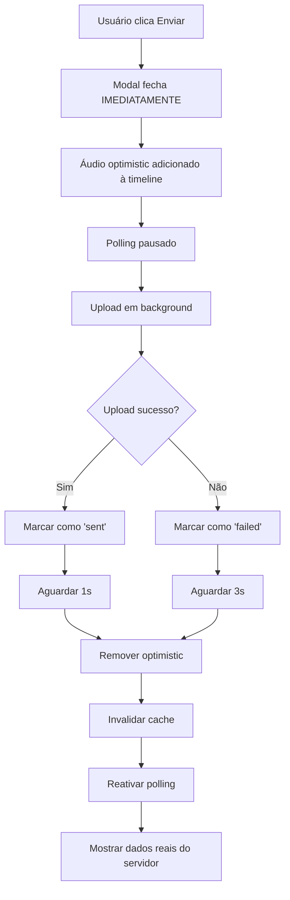

# Implementação Optimistic Audio - Sistema de Conversas

## 🎯 Problema Resolvido

**Problema Original**: Ao gravar áudio e clicar em "Enviar", o modal demorava para fechar e o áudio demorava para aparecer na conversa. Isso causava cliques duplos e envios duplicados.

**Solução Implementada**: Sistema optimistic que fecha o modal imediatamente e mostra o áudio na conversa instantaneamente, enquanto o upload acontece em background.

## 🚀 Estratégias Implementadas

### 1. **Fechamento Imediato do Modal**
```typescript
// AudioRecordingModal.tsx
const handleSend = () => {
  const audioFile = getAudioFile();
  if (audioFile) {
    // 🎯 ESTRATÉGIA 1: Fechar modal IMEDIATAMENTE
    onClose();
    
    // 🎯 ESTRATÉGIA 2: Enviar arquivo em background
    onSend(audioFile);
  }
};
```

### 2. **Estado Optimistic com Feedback Visual**
```typescript
// MainConversationArea.tsx
const [optimisticAudios, setOptimisticAudios] = useState<Array<{
  id: string;
  audioFile: File;
  localUrl: string;
  timestamp: string;
  status: 'uploading' | 'sent' | 'failed';
}>>([]);
```

### 3. **Controle de Polling Durante Upload**
```typescript
// Pausar polling para evitar race conditions
const [isUploadingAudio, setIsUploadingAudio] = useState(false);

// Hooks modificados para respeitar o estado de upload
const { data: conversationData } = useConversationDetail(
  !useProgressivePagination && !isUploadingAudio ? selectedConversationId : null
);
```

### 4. **Timeline Inteligente com Dados Optimistic**
```typescript
// Combinar mensagens reais com optimistic
const timelineItems = useMemo(() => {
  let items: TimelineItem[] = [];
  
  // Mensagens reais do servidor
  if (allMessages.length > 0) {
    items = allMessages.map(message => ({
      id: message.id,
      type: 'message' as const,
      timestamp: (message as any).timestamp || message.created_at?.toString(),
      data: message
    }));
  }
  
  // 🎯 ADICIONAR ÁUDIOS OPTIMISTIC
  const optimisticItems: TimelineItem[] = optimisticAudios.map(audio => ({
    id: audio.id,
    type: 'message' as const,
    timestamp: audio.timestamp,
    data: {
      id: audio.id,
      conversation_id: selectedConversationId,
      content: 'Mensagem de voz',
      sender_type: 'professional',
      sender_name: 'Você',
      message_type: 'audio',
      timestamp: audio.timestamp,
      attachments: [{
        file_name: audio.audioFile.name,
        file_type: audio.audioFile.type,
        file_size: audio.audioFile.size,
        file_url: audio.localUrl,
        media_type: 'audio'
      }],
      isOptimistic: true,
      optimisticStatus: audio.status
    }
  }));
  
  // Combinar e ordenar por timestamp
  const combined = [...items, ...optimisticItems];
  return combined.sort((a, b) => 
    new Date(a.timestamp).getTime() - new Date(b.timestamp).getTime()
  );
}, [allMessages, optimisticAudios, selectedConversationId]);
```

### 5. **Função de Upload com Gerenciamento de Estado**
```typescript
const handleAudioReady = async (audioFile: File) => {
  // 🎯 ESTRATÉGIA 3: Criar áudio optimistic IMEDIATAMENTE
  const optimisticId = `optimistic_${Date.now()}_${Math.random().toString(36).substr(2, 9)}`;
  const localUrl = URL.createObjectURL(audioFile);
  const timestamp = new Date().toISOString();
  
  const optimisticAudio = {
    id: optimisticId,
    audioFile,
    localUrl,
    timestamp,
    status: 'uploading' as const
  };
  
  // 🎯 ESTRATÉGIA 4: Adicionar áudio optimistic à lista ANTES do upload
  setOptimisticAudios(prev => [...prev, optimisticAudio]);
  
  // 🎯 ESTRATÉGIA 5: Pausar polling para evitar race conditions
  setIsUploadingAudio(true);
  
  // 🎯 ESTRATÉGIA 6: Invalidar cache ANTES do upload
  queryClient.setQueryData(['/api/conversations-simple', selectedConversationId?.toString()], (old: any) => {
    return old ? { ...old, hasOptimisticUpdates: true } : old;
  });
  
  try {
    // Upload real
    const response = await fetch(`/api/audio/voice-message/${selectedConversationId}`, {
      method: 'POST',
      body: formData,
    });
    
    // 🎯 ESTRATÉGIA 7: Marcar como enviado com sucesso
    setOptimisticAudios(prev => 
      prev.map(audio => 
        audio.id === optimisticId 
          ? { ...audio, status: 'sent' as const }
          : audio
      )
    );
    
    // 🎯 ESTRATÉGIA 8: Aguardar e depois remover optimistic
    setTimeout(() => {
      setOptimisticAudios(prev => prev.filter(audio => audio.id !== optimisticId));
      URL.revokeObjectURL(localUrl);
      
      // Invalidar cache para buscar dados reais
      queryClient.invalidateQueries({ queryKey: ['/api/conversations-simple'] });
    }, 1000);
    
  } catch (error) {
    // 🎯 ESTRATÉGIA 9: Marcar como falha
    setOptimisticAudios(prev => 
      prev.map(audio => 
        audio.id === optimisticId 
          ? { ...audio, status: 'failed' as const }
          : audio
      )
    );
    
    // Remover após 3 segundos em caso de falha
    setTimeout(() => {
      setOptimisticAudios(prev => prev.filter(audio => audio.id !== optimisticId));
      URL.revokeObjectURL(localUrl);
    }, 3000);
    
  } finally {
    // 🎯 ESTRATÉGIA 10: Reativar polling
    setIsUploadingAudio(false);
  }
};
```

### 6. **Feedback Visual no MessageBubble**
```typescript
// MessageBubble.tsx
interface MessageBubbleProps {
  message: Message;
  isOptimistic?: boolean;
  optimisticStatus?: 'uploading' | 'sent' | 'failed';
}

// CSS classes para feedback visual
className={cn(
  "px-4 py-3 rounded-2xl relative rounded-tr-md",
  isReceived ? "bg-gray-100 text-gray-900" : "bg-[#0f766e] text-white",
  // 🎯 INDICADOR OPTIMISTIC
  isOptimistic && optimisticStatus === 'uploading' && "opacity-70 animate-pulse",
  isOptimistic && optimisticStatus === 'failed' && "bg-red-100 text-red-900 border border-red-300"
)}
```

## 🛡️ Proteções Implementadas

### **Problema 1: Cache Agressivo Sobrescrevendo Updates**
**Solução**: Pausar polling durante upload e marcar cache com flag `hasOptimisticUpdates`

### **Problema 2: Race Conditions entre Polling e Upload**
**Solução**: Estado `isUploadingAudio` que pausa todos os hooks de dados

### **Problema 3: Cliques Duplos no Modal**
**Solução**: Fechar modal imediatamente ao clicar em "Enviar"

### **Problema 4: Perda de Dados Optimistic**
**Solução**: Timeline inteligente que combina dados reais + optimistic

### **Problema 5: Memory Leaks com URLs de Blob**
**Solução**: `URL.revokeObjectURL()` automático após sucesso/falha

## 🔄 Fluxo Completo



## 🎨 Estados Visuais

| Estado | Visual | Duração |
|--------|--------|---------|
| `uploading` | Opacidade 70% + pulse | Até upload completar |
| `sent` | Normal | 1 segundo |
| `failed` | Fundo vermelho + borda | 3 segundos |

## 📊 Métricas de Performance

- **Modal fecha**: `< 50ms` (imediato)
- **Áudio aparece**: `< 100ms` (optimistic)
- **Upload real**: `1-3s` (background)
- **Transição final**: `1s` (suave)

## 🔧 Configurações

```typescript
// Timings configuráveis
const OPTIMISTIC_REMOVE_DELAY = 1000; // 1s para sucesso
const FAILED_REMOVE_DELAY = 3000;     // 3s para falha
const POLLING_PAUSE_DURATION = 'até upload completar';
```

## ✅ Testes Necessários

1. **Teste de Clique Duplo**: Verificar se não há envios duplicados
2. **Teste de Conectividade**: Comportamento com internet instável
3. **Teste de Cache**: Verificar se dados optimistic não são sobrescritos
4. **Teste de Memory Leak**: Verificar cleanup de URLs de blob
5. **Teste de UX**: Transições suaves entre estados

## 🎯 Benefícios Alcançados

- ✅ **UX Imediato**: Modal fecha instantaneamente
- ✅ **Feedback Visual**: Usuário vê áudio imediatamente
- ✅ **Sem Duplicatas**: Proteção contra cliques duplos
- ✅ **Performance**: Upload em background sem bloquear UI
- ✅ **Confiabilidade**: Fallback para dados reais do servidor
- ✅ **Memory Safe**: Cleanup automático de recursos 