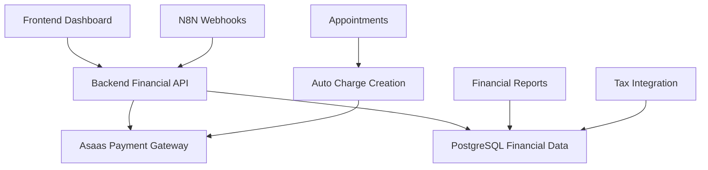

# Módulo Financeiro

## 📋 Visão Geral

O módulo financeiro do Operabase integra com a **API Asaas** para gestão completa de pagamentos, cobrança automática e controle financeiro. Oferece dashboard completo, relatórios detalhados e automação de cobrança vinculada aos agendamentos.

## 💰 Arquitetura Financeira

### Stack Financeiro



### Componentes Principais

1. **Asaas Integration**: Gateway de pagamento brasileiro
2. **Auto Billing**: Cobrança automática por agendamento
3. **Financial Dashboard**: Visão geral da situação financeira
4. **Payment Methods**: PIX, Cartão, Boleto
5. **Recurring Billing**: Mensalidades e assinaturas

## 🏦 Integração Asaas

### Configuração da API

```typescript
// server/services/asaas.service.ts
export class AsaasService {
  private apiKey: string;
  private baseURL: string;
  private environment: 'sandbox' | 'production';

  constructor() {
    this.apiKey = process.env.ASAAS_API_KEY!;
    this.environment = process.env.NODE_ENV === 'production' ? 'production' : 'sandbox';
    this.baseURL = this.environment === 'production' 
      ? 'https://api.asaas.com/v3'
      : 'https://sandbox.asaas.com/api/v3';
  }

  private async makeRequest(endpoint: string, method: string, data?: any): Promise<any> {
    const response = await fetch(`${this.baseURL}${endpoint}`, {
      method,
      headers: {
        'Content-Type': 'application/json',
        'access_token': this.apiKey
      },
      body: data ? JSON.stringify(data) : undefined
    });

    if (!response.ok) {
      throw new Error(`Asaas API error: ${response.status} ${response.statusText}`);
    }

    return response.json();
  }

  // Gerenciamento de clientes
  async createCustomer(customerData: AsaasCustomerData): Promise<AsaasCustomer> {
    return this.makeRequest('/customers', 'POST', customerData);
  }

  async updateCustomer(customerId: string, customerData: Partial<AsaasCustomerData>): Promise<AsaasCustomer> {
    return this.makeRequest(`/customers/${customerId}`, 'POST', customerData);
  }

  // Gerenciamento de cobranças
  async createCharge(chargeData: AsaasChargeData): Promise<AsaasCharge> {
    return this.makeRequest('/payments', 'POST', chargeData);
  }

  async getCharge(chargeId: string): Promise<AsaasCharge> {
    return this.makeRequest(`/payments/${chargeId}`, 'GET');
  }

  async cancelCharge(chargeId: string): Promise<AsaasCharge> {
    return this.makeRequest(`/payments/${chargeId}`, 'DELETE');
  }
}
```

### Estrutura de Dados Asaas

```typescript
interface AsaasCustomerData {
  name: string;
  email?: string;
  phone?: string;
  mobilePhone?: string;
  cpfCnpj?: string;
  postalCode?: string;
  address?: string;
  addressNumber?: string;
  complement?: string;
  province?: string;
  city?: string;
  state?: string;
  country?: string;
  externalReference?: string;
}

interface AsaasChargeData {
  customer: string; // ID do cliente no Asaas
  billingType: 'BOLETO' | 'CREDIT_CARD' | 'PIX' | 'UNDEFINED';
  value: number;
  dueDate: string; // YYYY-MM-DD
  description?: string;
  externalReference?: string;
  installmentCount?: number;
  installmentValue?: number;
  discount?: {
    value: number;
    dueDateLimitDays: number;
  };
  fine?: {
    value: number;
  };
  interest?: {
    value: number;
  };
  postalService?: boolean;
}

interface AsaasCharge {
  id: string;
  customer: string;
  billingType: string;
  pixTransaction?: string;
  value: number;
  netValue: number;
  originalValue: number;
  interestValue: number;
  description: string;
  status: 'PENDING' | 'RECEIVED' | 'CONFIRMED' | 'OVERDUE' | 'REFUNDED' | 'RECEIVED_IN_CASH' | 'REFUND_REQUESTED' | 'CHARGEBACK_REQUESTED' | 'CHARGEBACK_DISPUTE' | 'AWAITING_CHARGEBACK_REVERSAL' | 'DUNNING_REQUESTED' | 'DUNNING_RECEIVED' | 'AWAITING_RISK_ANALYSIS';
  dueDate: string;
  originalDueDate: string;
  paymentDate?: string;
  clientPaymentDate?: string;
  bankSlipUrl?: string;
  invoiceUrl?: string;
  pixQrCodeId?: string;
  externalReference?: string;
}
```

## 🏥 Gestão de Clientes

### Sincronização Automática

```typescript
// server/services/customer-sync.service.ts
export class CustomerSyncService {
  async syncContactToAsaas(contactId: number): Promise<string> {
    try {
      const contact = await storage.getContact(contactId);
      
      // Verificar se já existe cliente Asaas
      let customer = await storage.getCustomerByContactId(contactId);
      
      if (customer?.asaas_customer_id) {
        // Atualizar cliente existente
        const asaasCustomer = await this.asaasService.updateCustomer(
          customer.asaas_customer_id,
          this.mapContactToAsaasData(contact)
        );
        
        await storage.updateCustomer(customer.id, {
          name: asaasCustomer.name,
          email: asaasCustomer.email,
          phone: asaasCustomer.phone,
          cpf_cnpj: asaasCustomer.cpfCnpj
        });

        return customer.asaas_customer_id;
      } else {
        // Criar novo cliente
        const asaasCustomer = await this.asaasService.createCustomer(
          this.mapContactToAsaasData(contact)
        );

        customer = await storage.createCustomer({
          clinic_id: contact.clinic_id,
          contact_id: contactId,
          asaas_customer_id: asaasCustomer.id,
          name: asaasCustomer.name,
          email: asaasCustomer.email,
          phone: asaasCustomer.phone,
          cpf_cnpj: asaasCustomer.cpfCnpj,
          address: contact.address,
          city: contact.city,
          state: contact.state,
          postal_code: contact.postal_code
        });

        return asaasCustomer.id;
      }

    } catch (error) {
      console.error('Error syncing contact to Asaas:', error);
      throw error;
    }
  }

  private mapContactToAsaasData(contact: any): AsaasCustomerData {
    return {
      name: contact.name,
      email: contact.email,
      phone: contact.phone,
      cpfCnpj: contact.cpf_cnpj,
      postalCode: contact.postal_code?.replace(/\D/g, ''),
      address: contact.address,
      city: contact.city,
      state: contact.state,
      externalReference: `contact_${contact.id}`
    };
  }
}
```

## 💳 Sistema de Cobrança

### Cobrança Automática por Agendamento

```typescript
// server/services/auto-billing.service.ts
export class AutoBillingService {
  async createChargeForAppointment(appointmentId: number): Promise<string | null> {
    try {
      const appointment = await storage.getAppointment(appointmentId);
      
      // Verificar se já existe cobrança para este agendamento
      const existingCharge = await storage.getChargeByAppointmentId(appointmentId);
      if (existingCharge) {
        console.log(`Cobrança já existe para agendamento ${appointmentId}`);
        return existingCharge.asaas_charge_id;
      }

      // Verificar se agendamento tem valor
      if (!appointment.payment_amount || appointment.payment_amount <= 0) {
        console.log(`Agendamento ${appointmentId} sem valor para cobrança`);
        return null;
      }

      // Sincronizar cliente com Asaas
      const asaasCustomerId = await this.customerSyncService.syncContactToAsaas(
        appointment.contact_id
      );

      // Criar cobrança no Asaas
      const chargeData: AsaasChargeData = {
        customer: asaasCustomerId,
        billingType: 'PIX', // Padrão PIX para agilidade
        value: appointment.payment_amount / 100, // Converter centavos para reais
        dueDate: this.calculateDueDate(appointment.scheduled_date),
        description: `${appointment.appointment_type} - ${appointment.doctor_name}`,
        externalReference: `appointment_${appointmentId}`
      };

      const asaasCharge = await this.asaasService.createCharge(chargeData);

      // Salvar cobrança no banco local
      const charge = await storage.createCharge({
        clinic_id: appointment.clinic_id,
        customer_id: (await storage.getCustomerByContactId(appointment.contact_id))!.id,
        appointment_id: appointmentId,
        asaas_charge_id: asaasCharge.id,
        billing_type: asaasCharge.billingType,
        value: asaasCharge.value * 100, // Converter para centavos
        net_value: asaasCharge.netValue * 100,
        description: asaasCharge.description,
        status: asaasCharge.status,
        due_date: asaasCharge.dueDate,
        invoice_url: asaasCharge.invoiceUrl,
        bank_slip_url: asaasCharge.bankSlipUrl,
        pix_qr_code: asaasCharge.pixQrCodeId,
        external_reference: asaasCharge.externalReference
      });

      // Atualizar status de pagamento do agendamento
      await storage.updateAppointment(appointmentId, {
        payment_status: 'cobranca_criada'
      });

      console.log(`✅ Cobrança criada: ${asaasCharge.id} para agendamento ${appointmentId}`);
      return asaasCharge.id;

    } catch (error) {
      console.error('Error creating charge for appointment:', error);
      throw error;
    }
  }

  private calculateDueDate(appointmentDate: Date): string {
    // Vencimento 1 dia antes da consulta
    const dueDate = new Date(appointmentDate);
    dueDate.setDate(dueDate.getDate() - 1);
    return dueDate.toISOString().split('T')[0];
  }
}
```

### Tipos de Cobrança

```typescript
interface BillingTypes {
  PIX: {
    description: 'Pagamento instantâneo via PIX';
    processing_time: 'Imediato';
    fee: '3.49%';
    advantages: ['Pagamento instantâneo', 'Disponível 24/7', 'Sem necessidade de dados bancários'];
  };
  CREDIT_CARD: {
    description: 'Cartão de crédito';
    processing_time: '1 dia útil';
    fee: '4.99% + R$ 0,39';
    advantages: ['Parcelamento', 'Pagamento online', 'Chargeback protection'];
  };
  BOLETO: {
    description: 'Boleto bancário';
    processing_time: '2-3 dias úteis';
    fee: 'R$ 3,49';
    advantages: ['Pagamento em qualquer banco', 'Não precisa de conta digital'];
  };
}

// Escolha automática do tipo de cobrança
export const chooseBillingType = (
  patientProfile: PatientProfile,
  appointmentValue: number,
  urgency: 'low' | 'medium' | 'high'
): keyof BillingTypes => {
  // PIX para valores menores e pagamento rápido
  if (urgency === 'high' || appointmentValue < 5000) { // R$ 50
    return 'PIX';
  }
  
  // Cartão para valores maiores (possibilidade de parcelamento)
  if (appointmentValue > 20000) { // R$ 200
    return 'CREDIT_CARD';
  }
  
  // Boleto para pacientes que preferem pagamento tradicional
  if (patientProfile.age && patientProfile.age > 50) {
    return 'BOLETO';
  }
  
  return 'PIX'; // Padrão
};
```

## 📊 Dashboard Financeiro

### Métricas Principais

```typescript
// server/controllers/financial.controller.ts
export class FinancialController {
  async getDashboard(req: Request, res: Response) {
    try {
      const { clinicId } = req.user;
      const { startDate, endDate } = req.query;

      const dashboard = await this.financialService.getDashboardData(
        clinicId,
        startDate as string,
        endDate as string
      );

      res.json({
        success: true,
        data: dashboard
      });

    } catch (error) {
      console.error('Error getting financial dashboard:', error);
      res.status(500).json({ 
        success: false, 
        error: 'Failed to get financial dashboard' 
      });
    }
  }
}

// server/services/financial.service.ts
export class FinancialService {
  async getDashboardData(
    clinicId: number,
    startDate?: string,
    endDate?: string
  ): Promise<FinancialDashboard> {
    const dateFilter = this.buildDateFilter(startDate, endDate);

    // Receitas
    const totalRevenue = await this.calculateTotalRevenue(clinicId, dateFilter);
    const receivedRevenue = await this.calculateReceivedRevenue(clinicId, dateFilter);
    const pendingRevenue = await this.calculatePendingRevenue(clinicId, dateFilter);

    // Estatísticas por método de pagamento
    const paymentMethodStats = await this.getPaymentMethodStats(clinicId, dateFilter);

    // Cobranças em atraso
    const overdueCharges = await this.getOverdueCharges(clinicId);

    // Transações recentes
    const recentTransactions = await this.getRecentTransactions(clinicId, 10);

    // Projeções
    const monthlyProjection = await this.calculateMonthlyProjection(clinicId);

    return {
      revenue: {
        total: totalRevenue,
        received: receivedRevenue,
        pending: pendingRevenue,
        growth_rate: await this.calculateGrowthRate(clinicId, dateFilter)
      },
      payment_methods: paymentMethodStats,
      overdue: {
        count: overdueCharges.length,
        total_value: overdueCharges.reduce((sum, charge) => sum + charge.value, 0)
      },
      recent_transactions: recentTransactions,
      projections: {
        monthly_recurring: monthlyProjection.recurring,
        next_month_estimate: monthlyProjection.estimate
      },
      period: {
        start_date: dateFilter.start,
        end_date: dateFilter.end
      }
    };
  }

  private async calculateTotalRevenue(
    clinicId: number, 
    dateFilter: DateFilter
  ): Promise<number> {
    const result = await db.query(`
      SELECT COALESCE(SUM(value), 0) as total
      FROM charges c
      WHERE c.clinic_id = $1
        AND c.created_at >= $2
        AND c.created_at <= $3
    `, [clinicId, dateFilter.start, dateFilter.end]);

    return parseInt(result.rows[0].total) || 0;
  }

  private async calculateReceivedRevenue(
    clinicId: number, 
    dateFilter: DateFilter
  ): Promise<number> {
    const result = await db.query(`
      SELECT COALESCE(SUM(value), 0) as total
      FROM charges c
      WHERE c.clinic_id = $1
        AND c.status IN ('RECEIVED', 'CONFIRMED')
        AND c.payment_date >= $2
        AND c.payment_date <= $3
    `, [clinicId, dateFilter.start, dateFilter.end]);

    return parseInt(result.rows[0].total) || 0;
  }

  private async getPaymentMethodStats(
    clinicId: number, 
    dateFilter: DateFilter
  ): Promise<PaymentMethodStats[]> {
    const result = await db.query(`
      SELECT 
        billing_type,
        COUNT(*) as count,
        SUM(value) as total_value,
        AVG(value) as avg_value,
        COUNT(*) FILTER (WHERE status IN ('RECEIVED', 'CONFIRMED')) as paid_count
      FROM charges c
      WHERE c.clinic_id = $1
        AND c.created_at >= $2
        AND c.created_at <= $3
      GROUP BY billing_type
      ORDER BY total_value DESC
    `, [clinicId, dateFilter.start, dateFilter.end]);

    return result.rows.map(row => ({
      billing_type: row.billing_type,
      count: parseInt(row.count),
      total_value: parseInt(row.total_value),
      avg_value: parseInt(row.avg_value),
      conversion_rate: (parseInt(row.paid_count) / parseInt(row.count)) * 100
    }));
  }
}
```

### Interface do Dashboard

```typescript
interface FinancialDashboard {
  revenue: {
    total: number;
    received: number;
    pending: number;
    growth_rate: number;
  };
  payment_methods: PaymentMethodStats[];
  overdue: {
    count: number;
    total_value: number;
  };
  recent_transactions: Transaction[];
  projections: {
    monthly_recurring: number;
    next_month_estimate: number;
  };
  period: {
    start_date: string;
    end_date: string;
  };
}

interface PaymentMethodStats {
  billing_type: 'PIX' | 'CREDIT_CARD' | 'BOLETO';
  count: number;
  total_value: number;
  avg_value: number;
  conversion_rate: number;
}
```

## 🔔 Webhooks Asaas

### Processamento de Eventos

```typescript
// server/routes/asaas-webhooks.ts
export const asaasWebhookHandler = async (req: Request, res: Response) => {
  try {
    const { event, payment } = req.body;

    console.log(`📥 Webhook Asaas recebido: ${event} para pagamento ${payment.id}`);

    switch (event) {
      case 'PAYMENT_RECEIVED':
        await handlePaymentReceived(payment);
        break;
      
      case 'PAYMENT_OVERDUE':
        await handlePaymentOverdue(payment);
        break;
      
      case 'PAYMENT_DELETED':
        await handlePaymentDeleted(payment);
        break;
      
      case 'PAYMENT_RESTORED':
        await handlePaymentRestored(payment);
        break;
      
      default:
        console.log(`⚠️ Evento não tratado: ${event}`);
    }

    res.status(200).json({ success: true });

  } catch (error) {
    console.error('❌ Erro processando webhook Asaas:', error);
    res.status(500).json({ success: false, error: error.message });
  }
};

async function handlePaymentReceived(payment: AsaasPayment) {
  try {
    // Atualizar cobrança local
    await storage.updateChargeByAsaasId(payment.id, {
      status: payment.status,
      payment_date: payment.paymentDate ? new Date(payment.paymentDate) : null,
      net_value: payment.netValue ? payment.netValue * 100 : null
    });

    // Atualizar agendamento se aplicável
    if (payment.externalReference?.startsWith('appointment_')) {
      const appointmentId = parseInt(payment.externalReference.replace('appointment_', ''));
      
      await storage.updateAppointment(appointmentId, {
        payment_status: 'pago'
      });

      // Log da atividade
      await systemLogsService.logFinancialActivity(
        'payment_received',
        appointmentId,
        payment.customer.clinic_id,
        payment.customer.id,
        'system',
        null,
        {
          payment_id: payment.id,
          value: payment.value,
          billing_type: payment.billingType,
          payment_date: payment.paymentDate
        }
      );

      console.log(`✅ Pagamento recebido: R$ ${payment.value} para agendamento ${appointmentId}`);
    }

  } catch (error) {
    console.error('Erro processando pagamento recebido:', error);
    throw error;
  }
}

async function handlePaymentOverdue(payment: AsaasPayment) {
  try {
    // Atualizar status local
    await storage.updateChargeByAsaasId(payment.id, {
      status: 'OVERDUE'
    });

    // Notificar equipe sobre atraso
    // Implementar notificações push/email

    console.log(`⚠️ Pagamento em atraso: ${payment.id}`);

  } catch (error) {
    console.error('Erro processando pagamento em atraso:', error);
  }
}
```

## 📈 Relatórios Financeiros

### Geração de Relatórios

```typescript
// server/services/financial-reports.service.ts
export class FinancialReportsService {
  async generateMonthlyReport(
    clinicId: number,
    year: number,
    month: number
  ): Promise<MonthlyFinancialReport> {
    const startDate = new Date(year, month - 1, 1);
    const endDate = new Date(year, month, 0);

    const [
      revenue,
      expenses,
      chargesSummary,
      paymentMethods,
      topPatients
    ] = await Promise.all([
      this.calculateMonthlyRevenue(clinicId, startDate, endDate),
      this.calculateMonthlyExpenses(clinicId, startDate, endDate),
      this.getChargesSummary(clinicId, startDate, endDate),
      this.getPaymentMethodBreakdown(clinicId, startDate, endDate),
      this.getTopPayingPatients(clinicId, startDate, endDate, 10)
    ]);

    return {
      clinic_id: clinicId,
      period: {
        year,
        month,
        start_date: startDate.toISOString(),
        end_date: endDate.toISOString()
      },
      summary: {
        total_revenue: revenue.total,
        total_expenses: expenses.total,
        net_profit: revenue.total - expenses.total,
        charges_created: chargesSummary.created,
        charges_paid: chargesSummary.paid,
        conversion_rate: (chargesSummary.paid / chargesSummary.created) * 100
      },
      revenue_breakdown: revenue.breakdown,
      payment_methods: paymentMethods,
      top_patients: topPatients,
      generated_at: new Date()
    };
  }

  async exportToCSV(
    clinicId: number,
    startDate: string,
    endDate: string
  ): Promise<string> {
    const charges = await storage.getChargesForPeriod(clinicId, startDate, endDate);
    
    const csvData = [
      ['Data', 'Cliente', 'Valor', 'Tipo', 'Status', 'Data Pagamento', 'Referência'],
      ...charges.map(charge => [
        charge.created_at.toLocaleDateString('pt-BR'),
        charge.customer_name,
        (charge.value / 100).toFixed(2),
        charge.billing_type,
        charge.status,
        charge.payment_date?.toLocaleDateString('pt-BR') || '',
        charge.external_reference || ''
      ])
    ];

    return csvData.map(row => row.join(',')).join('\n');
  }
}

interface MonthlyFinancialReport {
  clinic_id: number;
  period: {
    year: number;
    month: number;
    start_date: string;
    end_date: string;
  };
  summary: {
    total_revenue: number;
    total_expenses: number;
    net_profit: number;
    charges_created: number;
    charges_paid: number;
    conversion_rate: number;
  };
  revenue_breakdown: RevenueBreakdown[];
  payment_methods: PaymentMethodStats[];
  top_patients: TopPatient[];
  generated_at: Date;
}
```

## 🔧 Configuração e Troubleshooting

### Variáveis de Ambiente

```bash
# Asaas Configuration
ASAAS_API_KEY=your-asaas-api-key
ASAAS_ENVIRONMENT=sandbox  # ou production
ASAAS_WEBHOOK_URL=https://your-domain.com/api/webhooks/asaas

# Financial Settings
AUTO_BILLING_ENABLED=true
DEFAULT_BILLING_TYPE=PIX
PAYMENT_DUE_DAYS=1  # Dias antes da consulta para vencimento
OVERDUE_NOTIFICATION_ENABLED=true

# Fees and Limits
PIX_FEE_PERCENTAGE=3.49
CREDIT_CARD_FEE_PERCENTAGE=4.99
BOLETO_FEE_FIXED=349  # centavos
MIN_CHARGE_VALUE=100   # R$ 1,00 em centavos
```

### Troubleshooting Comum

#### 1. Webhooks não chegam

```bash
# Verificar configuração do webhook
curl -X GET "https://sandbox.asaas.com/api/v3/webhooks" \
  -H "access_token: your-api-key"

# Reconfigurar webhook
curl -X POST "https://sandbox.asaas.com/api/v3/webhooks" \
  -H "access_token: your-api-key" \
  -H "Content-Type: application/json" \
  -d '{
    "name": "Operabase Webhook",
    "url": "https://your-domain.com/api/webhooks/asaas",
    "events": ["PAYMENT_RECEIVED", "PAYMENT_OVERDUE"],
    "enabled": true
  }'
```

#### 2. Cobrança não criada

```sql
-- Verificar configuração de cobrança automática
SELECT 
  a.id,
  a.payment_amount,
  a.payment_status,
  c.name as patient_name,
  c.phone
FROM appointments a
JOIN contacts c ON a.contact_id = c.id
WHERE a.payment_amount > 0 
  AND a.payment_status = 'pendente'
  AND NOT EXISTS (
    SELECT 1 FROM charges ch WHERE ch.appointment_id = a.id
  );
```

#### 3. Sincronização de status

```typescript
// Sincronizar status com Asaas
export const syncChargeStatus = async (chargeId: string) => {
  try {
    const asaasCharge = await asaasService.getCharge(chargeId);
    
    await storage.updateChargeByAsaasId(chargeId, {
      status: asaasCharge.status,
      payment_date: asaasCharge.paymentDate ? new Date(asaasCharge.paymentDate) : null,
      net_value: asaasCharge.netValue ? asaasCharge.netValue * 100 : null
    });

    console.log(`✅ Status sincronizado: ${chargeId} -> ${asaasCharge.status}`);

  } catch (error) {
    console.error(`❌ Erro sincronizando ${chargeId}:`, error);
  }
};
```

---

**Próximas Seções:**
- [Anamneses e Prontuários](medical-records.md)
- [Monitoramento e Logs](monitoring.md)
- [Deployment e DevOps](deployment.md) 