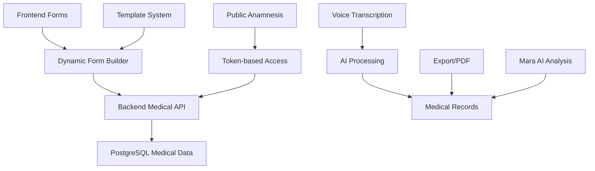

# Anamneses e Prontuários Médicos

Sistema de registros médicos completo com formulários dinâmicos e compartilhamento seguro.

## 📋 Visão Geral

O sistema de anamneses e prontuários do Operabase oferece gestão completa de registros médicos com formulários dinâmicos, compartilhamento seguro, integração com IA para análise e estrutura completa para documentação clínica.

## 📝 Arquitetura do Sistema Médico

### Stack de Registros Médicos



### Componentes Principais

1. **Anamnesis Templates**: Formulários customizáveis por especialidade
2. **Public Forms**: Acesso seguro para pacientes
3. **Medical Records**: Prontuários estruturados
4. **Voice Integration**: Transcrição de consultas
5. **AI Analysis**: Insights automáticos via Mara

## 📋 Sistema de Anamneses

### Templates Dinâmicos

```typescript
// shared/types/anamnesis.types.ts
interface AnamnesisTemplate {
  id: number;
  clinic_id: number;
  name: string;
  description: string;
  fields: AnamnesisField[];
  is_default: boolean;
  is_active: boolean;
  created_by: string;
  created_at: Date;
  updated_at: Date;
}

interface AnamnesisField {
  id: string;
  type: 'text' | 'textarea' | 'select' | 'radio' | 'checkbox' | 'date' | 'number' | 'file';
  label: string;
  placeholder?: string;
  required: boolean;
  options?: string[]; // Para select, radio, checkbox
  validation?: {
    min?: number;
    max?: number;
    pattern?: string;
    message?: string;
  };
  conditional?: {
    dependsOn: string;
    value: any;
    operator: 'equals' | 'not_equals' | 'contains' | 'greater_than' | 'less_than';
  };
  section: string;
  order: number;
}

interface AnamnesisResponse {
  id: number;
  clinic_id: number;
  contact_id: number;
  template_id: number;
  responses: Record<string, any>;
  status: 'pending' | 'in_progress' | 'completed' | 'expired';
  share_token: string;
  patient_name: string;
  patient_email?: string;
  patient_phone?: string;
  completed_at?: Date;
  expires_at: Date;
  created_by?: string;
  created_at: Date;
  updated_at: Date;
}
```

### Criação de Templates

```typescript
// server/services/anamnesis-template.service.ts
export class AnamnesisTemplateService {
  async createTemplate(
    clinicId: number,
    userId: string,
    templateData: CreateAnamnesisTemplateData
  ): Promise<AnamnesisTemplate> {
    try {
      // Validar estrutura dos campos
      this.validateFields(templateData.fields);

      const template = await storage.createAnamnesisTemplate({
        clinic_id: clinicId,
        name: templateData.name,
        description: templateData.description,
        fields: templateData.fields,
        is_default: templateData.is_default || false,
        is_active: true,
        created_by: userId
      });

      // Log da criação
      await systemLogsService.logMedicalActivity(
        'anamnesis_template_created',
        template.id,
        clinicId,
        null,
        'professional',
        userId,
        { template_name: template.name, field_count: template.fields.length }
      );

      return template;

    } catch (error) {
      console.error('Error creating anamnesis template:', error);
      throw error;
    }
  }

  private validateFields(fields: AnamnesisField[]): void {
    const fieldIds = new Set<string>();
    
    for (const field of fields) {
      // Verificar IDs únicos
      if (fieldIds.has(field.id)) {
        throw new Error(`Campo duplicado: ${field.id}`);
      }
      fieldIds.add(field.id);

      // Validar tipos
      if (!['text', 'textarea', 'select', 'radio', 'checkbox', 'date', 'number', 'file'].includes(field.type)) {
        throw new Error(`Tipo de campo inválido: ${field.type}`);
      }

      // Validar opções para campos de seleção
      if (['select', 'radio', 'checkbox'].includes(field.type) && (!field.options || field.options.length === 0)) {
        throw new Error(`Campo ${field.id} requer opções`);
      }

      // Validar dependências condicionais
      if (field.conditional) {
        const dependentField = fields.find(f => f.id === field.conditional!.dependsOn);
        if (!dependentField) {
          throw new Error(`Campo dependente não encontrado: ${field.conditional.dependsOn}`);
        }
      }
    }
  }

  async getTemplatesByClinic(clinicId: number): Promise<AnamnesisTemplate[]> {
    return storage.getAnamnesisTemplatesByClinic(clinicId, { is_active: true });
  }

  async duplicateTemplate(
    templateId: number,
    clinicId: number,
    userId: string,
    newName: string
  ): Promise<AnamnesisTemplate> {
    const originalTemplate = await storage.getAnamnesisTemplate(templateId);
    
    if (!originalTemplate || originalTemplate.clinic_id !== clinicId) {
      throw new Error('Template não encontrado');
    }

    return this.createTemplate(clinicId, userId, {
      name: newName,
      description: `Cópia de: ${originalTemplate.description}`,
      fields: originalTemplate.fields,
      is_default: false
    });
  }
}
```

### Templates Pré-definidos

```typescript
// server/data/default-anamnesis-templates.ts
export const defaultAnamnesisTemplates = {
  CLINICA_GERAL: {
    name: "Anamnese Clínica Geral",
    description: "Formulário padrão para consultas de clínica geral",
    fields: [
      {
        id: "chief_complaint",
        type: "textarea",
        label: "Queixa Principal",
        placeholder: "Descreva o motivo da consulta",
        required: true,
        section: "Identificação",
        order: 1
      },
      {
        id: "symptoms_duration",
        type: "select",
        label: "Há quanto tempo apresenta os sintomas?",
        required: true,
        options: ["Menos de 1 semana", "1-2 semanas", "2-4 semanas", "1-3 meses", "Mais de 3 meses"],
        section: "História Atual",
        order: 2
      },
      {
        id: "pain_scale",
        type: "radio",
        label: "Escala de dor (0-10)",
        required: false,
        options: ["0", "1", "2", "3", "4", "5", "6", "7", "8", "9", "10"],
        section: "História Atual",
        order: 3,
        conditional: {
          dependsOn: "chief_complaint",
          value: "dor",
          operator: "contains"
        }
      },
      {
        id: "current_medications",
        type: "textarea",
        label: "Medicações em uso",
        placeholder: "Liste todos os medicamentos que está tomando",
        required: false,
        section: "Medicações",
        order: 4
      },
      {
        id: "allergies",
        type: "textarea",
        label: "Alergias conhecidas",
        placeholder: "Medicamentos, alimentos, outras substâncias",
        required: false,
        section: "Alergias",
        order: 5
      },
      {
        id: "previous_surgeries",
        type: "textarea",
        label: "Cirurgias anteriores",
        placeholder: "Liste cirurgias e datas aproximadas",
        required: false,
        section: "História Médica",
        order: 6
      },
      {
        id: "family_history",
        type: "checkbox",
        label: "História familiar",
        required: false,
        options: [
          "Diabetes",
          "Hipertensão",
          "Doenças cardíacas",
          "Câncer",
          "Doenças neurológicas",
          "Outras"
        ],
        section: "História Familiar",
        order: 7
      },
      {
        id: "lifestyle",
        type: "radio",
        label: "Tabagismo",
        required: false,
        options: ["Nunca fumou", "Ex-fumante", "Fumante atual"],
        section: "Estilo de Vida",
        order: 8
      },
      {
        id: "alcohol_consumption",
        type: "radio",
        label: "Consumo de álcool",
        required: false,
        options: ["Não bebe", "Socialmente", "Regularmente", "Diariamente"],
        section: "Estilo de Vida",
        order: 9
      },
      {
        id: "additional_info",
        type: "textarea",
        label: "Informações adicionais",
        placeholder: "Outras informações que considera importantes",
        required: false,
        section: "Observações",
        order: 10
      }
    ]
  },

  ODONTOLOGIA: {
    name: "Anamnese Odontológica",
    description: "Formulário específico para consultas odontológicas",
    fields: [
      {
        id: "dental_complaint",
        type: "textarea",
        label: "Qual o problema que o trouxe até aqui?",
        required: true,
        section: "Queixa Principal",
        order: 1
      },
      {
        id: "pain_location",
        type: "text",
        label: "Onde sente dor? (especifique o dente/região)",
        required: false,
        section: "Dor Dental",
        order: 2
      },
      {
        id: "pain_triggers",
        type: "checkbox",
        label: "O que desencadeia a dor?",
        required: false,
        options: [
          "Alimentos quentes",
          "Alimentos frios",
          "Doces",
          "Mastigação",
          "Espontânea",
          "Pressão"
        ],
        section: "Dor Dental",
        order: 3
      },
      {
        id: "oral_hygiene",
        type: "radio",
        label: "Quantas vezes escova os dentes por dia?",
        required: true,
        options: ["1 vez", "2 vezes", "3 vezes", "Mais de 3 vezes"],
        section: "Higiene Oral",
        order: 4
      },
      {
        id: "floss_frequency",
        type: "radio",
        label: "Com que frequência usa fio dental?",
        required: true,
        options: ["Nunca", "Raramente", "Algumas vezes por semana", "Diariamente"],
        section: "Higiene Oral",
        order: 5
      },
      {
        id: "gum_bleeding",
        type: "radio",
        label: "Suas gengivas sangram?",
        required: true,
        options: ["Nunca", "Raramente", "Frequentemente", "Sempre"],
        section: "Saúde Gengival",
        order: 6
      },
      {
        id: "dental_trauma",
        type: "textarea",
        label: "Já sofreu algum trauma dental?",
        placeholder: "Descreva acidentes ou traumas nos dentes",
        required: false,
        section: "História Dental",
        order: 7
      },
      {
        id: "orthodontic_history",
        type: "radio",
        label: "Já usou aparelho ortodôntico?",
        required: false,
        options: ["Nunca", "Sim, no passado", "Usando atualmente"],
        section: "História Dental",
        order: 8
      }
    ]
  }
};
```

## 🔗 Sistema de Compartilhamento Público

### Geração de Links Seguros

```typescript
// server/services/anamnesis-sharing.service.ts
export class AnamnesisShareService {
  async createPublicAnamnesis(
    contactId: number,
    templateId: number,
    userId: string,
    options: {
      patient_name: string;
      patient_email?: string;
      patient_phone?: string;
      expires_in_hours?: number;
    }
  ): Promise<{ anamnesis: AnamnesisResponse; public_url: string }> {
    try {
      const contact = await storage.getContact(contactId);
      const template = await storage.getAnamnesisTemplate(templateId);

      if (!contact || !template) {
        throw new Error('Contato ou template não encontrado');
      }

      // Gerar token único e seguro
      const shareToken = this.generateSecureToken();
      
      // Data de expiração (padrão: 7 dias)
      const expiresAt = new Date();
      expiresAt.setHours(expiresAt.getHours() + (options.expires_in_hours || 168));

      const anamnesis = await storage.createAnamnesisResponse({
        clinic_id: contact.clinic_id,
        contact_id: contactId,
        template_id: templateId,
        responses: {},
        status: 'pending',
        share_token: shareToken,
        patient_name: options.patient_name,
        patient_email: options.patient_email,
        patient_phone: options.patient_phone,
        expires_at: expiresAt,
        created_by: userId
      });

      const publicUrl = `${process.env.FRONTEND_URL}/anamnese/${shareToken}`;

      // Log da criação
      await systemLogsService.logMedicalActivity(
        'anamnesis_shared',
        anamnesis.id,
        contact.clinic_id,
        contactId,
        'professional',
        userId,
        {
          template_name: template.name,
          expires_at: expiresAt,
          public_url: publicUrl
        }
      );

      return { anamnesis, public_url: publicUrl };

    } catch (error) {
      console.error('Error creating public anamnesis:', error);
      throw error;
    }
  }

  private generateSecureToken(): string {
    const timestamp = Date.now().toString(36);
    const randomBytes = crypto.randomBytes(32).toString('hex');
    return `${timestamp}_${randomBytes}`;
  }

  async getPublicAnamnesis(token: string): Promise<PublicAnamnesisView | null> {
    try {
      const anamnesis = await storage.getAnamnesisResponseByToken(token);

      if (!anamnesis) {
        return null;
      }

      // Verificar expiração
      if (new Date() > anamnesis.expires_at) {
        await storage.updateAnamnesisResponse(anamnesis.id, {
          status: 'expired'
        });
        return null;
      }

      const template = await storage.getAnamnesisTemplate(anamnesis.template_id);
      const clinic = await storage.getClinic(anamnesis.clinic_id);

      return {
        id: anamnesis.id,
        template: {
          name: template.name,
          description: template.description,
          fields: template.fields
        },
        clinic: {
          name: clinic.name,
          phone: clinic.phone,
          email: clinic.email
        },
        patient: {
          name: anamnesis.patient_name,
          email: anamnesis.patient_email,
          phone: anamnesis.patient_phone
        },
        status: anamnesis.status,
        responses: anamnesis.responses,
        expires_at: anamnesis.expires_at,
        created_at: anamnesis.created_at
      };

    } catch (error) {
      console.error('Error getting public anamnesis:', error);
      return null;
    }
  }

  async submitPublicAnamnesis(
    token: string,
    responses: Record<string, any>
  ): Promise<{ success: boolean; message: string }> {
    try {
      const anamnesis = await this.getPublicAnamnesis(token);

      if (!anamnesis) {
        return { success: false, message: 'Anamnese não encontrada ou expirada' };
      }

      if (anamnesis.status === 'completed') {
        return { success: false, message: 'Esta anamnese já foi preenchida' };
      }

      // Validar respostas obrigatórias
      const missingRequired = this.validateRequiredFields(anamnesis.template.fields, responses);
      if (missingRequired.length > 0) {
        return { 
          success: false, 
          message: `Campos obrigatórios não preenchidos: ${missingRequired.join(', ')}` 
        };
      }

      // Salvar respostas
      await storage.updateAnamnesisResponse(anamnesis.id, {
        responses,
        status: 'completed',
        completed_at: new Date()
      });

      // Notificar profissional via WhatsApp/Email
      await this.notifyProfessionalAnamnesisCompleted(anamnesis.id);

      // Log da submissão
      await systemLogsService.logMedicalActivity(
        'anamnesis_completed',
        anamnesis.id,
        anamnesis.clinic.id,
        null,
        'patient',
        null,
        {
          patient_name: anamnesis.patient.name,
          response_count: Object.keys(responses).length,
          completed_at: new Date()
        }
      );

      return { success: true, message: 'Anamnese enviada com sucesso!' };

    } catch (error) {
      console.error('Error submitting public anamnesis:', error);
      return { success: false, message: 'Erro interno. Tente novamente.' };
    }
  }

  private validateRequiredFields(
    fields: AnamnesisField[], 
    responses: Record<string, any>
  ): string[] {
    const missing: string[] = [];

    for (const field of fields) {
      if (field.required) {
        const value = responses[field.id];
        
        if (value === undefined || value === null || value === '' || 
            (Array.isArray(value) && value.length === 0)) {
          missing.push(field.label);
        }
      }
    }

    return missing;
  }

  private async notifyProfessionalAnamnesisCompleted(anamnesisId: number): Promise<void> {
    // Implementar notificação via WhatsApp/Email
    // Integração com sistema de comunicação
  }
}
```

## 🏥 Sistema de Prontuários

### Estrutura de Prontuários

```typescript
// shared/types/medical-records.types.ts
interface MedicalRecord {
  id: number;
  clinic_id: number;
  contact_id: number;
  appointment_id?: number;
  record_type: 'consultation' | 'procedure' | 'exam' | 'prescription' | 'follow_up';
  content: string;
  chief_complaint?: string;
  history_present_illness?: string;
  physical_examination?: string;
  diagnosis?: string;
  treatment_plan?: string;
  prescriptions?: Prescription[];
  exam_requests?: ExamRequest[];
  follow_up_instructions?: string;
  observations?: string;
  vital_signs?: VitalSigns;
  attachments?: string[];
  voice_transcription?: string;
  ai_summary?: string;
  templates_used?: string[];
  version: number;
  is_active: boolean;
  created_by: string;
  updated_by?: string;
  created_at: Date;
  updated_at: Date;
}

interface Prescription {
  medication: string;
  dosage: string;
  frequency: string;
  duration: string;
  instructions: string;
  generic_allowed: boolean;
}

interface ExamRequest {
  exam_type: string;
  urgency: 'routine' | 'urgent' | 'emergency';
  instructions?: string;
  clinical_indication: string;
}

interface VitalSigns {
  weight?: number;
  height?: number;
  bmi?: number;
  blood_pressure_systolic?: number;
  blood_pressure_diastolic?: number;
  heart_rate?: number;
  temperature?: number;
  oxygen_saturation?: number;
  respiratory_rate?: number;
}
```

### Criação e Edição de Prontuários

```typescript
// server/services/medical-records.service.ts
export class MedicalRecordsService {
  async createMedicalRecord(
    data: CreateMedicalRecordData,
    userId: string
  ): Promise<MedicalRecord> {
    try {
      // Validar permissões
      const hasPermission = await this.validateMedicalRecordPermission(
        userId, 
        data.clinic_id, 
        data.contact_id
      );

      if (!hasPermission) {
        throw new Error('Sem permissão para criar prontuário');
      }

      // Processar transcrição de voz se presente
      if (data.voice_transcription) {
        data.ai_summary = await this.generateAISummary(data.voice_transcription);
      }

      // Calcular BMI se peso e altura estão presentes
      if (data.vital_signs?.weight && data.vital_signs?.height) {
        const heightInMeters = data.vital_signs.height / 100;
        data.vital_signs.bmi = Number(
          (data.vital_signs.weight / (heightInMeters * heightInMeters)).toFixed(1)
        );
      }

      const record = await storage.createMedicalRecord({
        ...data,
        version: 1,
        is_active: true,
        created_by: userId
      });

      // Integrar com sistema de anamneses se aplicável
      if (data.appointment_id) {
        await this.linkAnamnesisToRecord(data.appointment_id, record.id);
      }

      // Log da criação
      await systemLogsService.logMedicalActivity(
        'medical_record_created',
        record.id,
        data.clinic_id,
        data.contact_id,
        'professional',
        userId,
        {
          record_type: data.record_type,
          has_diagnosis: !!data.diagnosis,
          has_prescriptions: data.prescriptions && data.prescriptions.length > 0,
          has_voice: !!data.voice_transcription
        }
      );

      return record;

    } catch (error) {
      console.error('Error creating medical record:', error);
      throw error;
    }
  }

  async updateMedicalRecord(
    recordId: number,
    updates: Partial<MedicalRecord>,
    userId: string
  ): Promise<MedicalRecord> {
    try {
      const existingRecord = await storage.getMedicalRecord(recordId);
      
      if (!existingRecord) {
        throw new Error('Prontuário não encontrado');
      }

      // Validar permissões
      const hasPermission = await this.validateMedicalRecordPermission(
        userId,
        existingRecord.clinic_id,
        existingRecord.contact_id
      );

      if (!hasPermission) {
        throw new Error('Sem permissão para editar prontuário');
      }

      // Criar nova versão
      const updatedRecord = await storage.updateMedicalRecord(recordId, {
        ...updates,
        version: existingRecord.version + 1,
        updated_by: userId,
        updated_at: new Date()
      });

      // Log da atualização
      await systemLogsService.logMedicalActivity(
        'medical_record_updated',
        recordId,
        existingRecord.clinic_id,
        existingRecord.contact_id,
        'professional',
        userId,
        {
          previous_version: existingRecord.version,
          new_version: updatedRecord.version,
          fields_updated: Object.keys(updates)
        }
      );

      return updatedRecord;

    } catch (error) {
      console.error('Error updating medical record:', error);
      throw error;
    }
  }

  private async linkAnamnesisToRecord(
    appointmentId: number, 
    recordId: number
  ): Promise<void> {
    const appointment = await storage.getAppointment(appointmentId);
    if (!appointment) return;

    // Buscar anamnese completa do paciente
    const completedAnamnesis = await storage.getCompletedAnamnesisForContact(
      appointment.contact_id
    );

    if (completedAnamnesis && completedAnamnesis.length > 0) {
      // Integrar dados da anamnese ao prontuário
      const anamnesisData = this.extractRelevantAnamnesisData(completedAnamnesis[0]);
      
      await storage.updateMedicalRecord(recordId, {
        content: `${anamnesisData}\n\n---\n\n` + (await storage.getMedicalRecord(recordId))?.content
      });
    }
  }

  private extractRelevantAnamnesisData(anamnesis: AnamnesisResponse): string {
    const responses = anamnesis.responses;
    let text = `DADOS DA ANAMNESE (${anamnesis.created_at.toLocaleDateString('pt-BR')}):\n\n`;

    // Extrair campos principais
    if (responses.chief_complaint) {
      text += `Queixa Principal: ${responses.chief_complaint}\n`;
    }
    if (responses.symptoms_duration) {
      text += `Duração dos sintomas: ${responses.symptoms_duration}\n`;
    }
    if (responses.current_medications) {
      text += `Medicações atuais: ${responses.current_medications}\n`;
    }
    if (responses.allergies) {
      text += `Alergias: ${responses.allergies}\n`;
    }
    if (responses.previous_surgeries) {
      text += `Cirurgias anteriores: ${responses.previous_surgeries}\n`;
    }

    return text;
  }

  private async generateAISummary(voiceTranscription: string): Promise<string> {
    try {
      // Integração com Mara AI para gerar resumo
      const summary = await maraAIService.summarizeConsultation(voiceTranscription);
      return summary.response || '';
    } catch (error) {
      console.error('Error generating AI summary:', error);
      return '';
    }
  }

  async getMedicalHistory(
    contactId: number,
    clinicId: number,
    filters?: {
      record_type?: string;
      date_start?: string;
      date_end?: string;
      limit?: number;
    }
  ): Promise<MedicalHistoryView> {
    const records = await storage.getMedicalRecordsByContact(contactId, {
      clinic_id: clinicId,
      is_active: true,
      ...filters,
      order_by: 'created_at',
      order: 'DESC'
    });

    const anamneses = await storage.getAnamnesisResponsesByContact(contactId, {
      status: 'completed',
      order_by: 'completed_at',
      order: 'DESC'
    });

    const appointments = await storage.getAppointmentsByContact(contactId, {
      clinic_id: clinicId,
      order_by: 'scheduled_date',
      order: 'DESC',
      limit: 20
    });

    return {
      contact_id: contactId,
      medical_records: records,
      anamneses: anamneses,
      appointments: appointments,
      summary: {
        total_consultations: records.filter(r => r.record_type === 'consultation').length,
        total_procedures: records.filter(r => r.record_type === 'procedure').length,
        latest_consultation: records.find(r => r.record_type === 'consultation')?.created_at,
        last_anamnesis: anamneses[0]?.completed_at,
        active_medications: this.extractActiveMedications(records),
        known_allergies: this.extractAllergies(records, anamneses)
      }
    };
  }

  private extractActiveMedications(records: MedicalRecord[]): string[] {
    const medications = new Set<string>();
    
    records.forEach(record => {
      if (record.prescriptions) {
        record.prescriptions.forEach(prescription => {
          medications.add(prescription.medication);
        });
      }
    });

    return Array.from(medications);
  }

  private extractAllergies(
    records: MedicalRecord[], 
    anamneses: AnamnesisResponse[]
  ): string[] {
    const allergies = new Set<string>();

    // De prontuários
    records.forEach(record => {
      if (record.observations?.toLowerCase().includes('alergia')) {
        // Extrair alergias das observações
      }
    });

    // De anamneses
    anamneses.forEach(anamnesis => {
      if (anamnesis.responses.allergies) {
        allergies.add(anamnesis.responses.allergies);
      }
    });

    return Array.from(allergies);
  }
}
```

## 🔧 Configuração e Troubleshooting

### Variáveis de Ambiente

```bash
# Anamnesis Configuration
ANAMNESIS_TOKEN_EXPIRY_HOURS=168  # 7 days
ANAMNESIS_PUBLIC_URL=https://your-domain.com/anamnese
MAX_ANAMNESIS_FIELDS=50
ANAMNESIS_FILE_UPLOAD_ENABLED=true

# Medical Records
MEDICAL_RECORDS_VERSIONING_ENABLED=true
VOICE_TRANSCRIPTION_ENABLED=true
AI_SUMMARY_ENABLED=true
MEDICAL_RECORDS_EXPORT_ENABLED=true

# File Storage
MEDICAL_FILES_BUCKET=medical-records
MAX_FILE_SIZE_MB=50
ALLOWED_FILE_TYPES=pdf,jpg,jpeg,png,doc,docx
```

### Troubleshooting Comum

#### 1. Anamnese não carrega

```sql
-- Verificar token e expiração
SELECT 
  ar.*,
  at.name as template_name,
  c.name as clinic_name
FROM anamnesis_responses ar
JOIN anamnesis_templates at ON ar.template_id = at.id
JOIN clinics c ON ar.clinic_id = c.id
WHERE ar.share_token = $1;
```

#### 2. Campos condicionais não funcionam

```typescript
// Debug de dependências de campos
const validateFieldDependencies = (fields: AnamnesisField[]) => {
  const fieldMap = new Map(fields.map(f => [f.id, f]));
  
  for (const field of fields) {
    if (field.conditional) {
      const dependency = fieldMap.get(field.conditional.dependsOn);
      if (!dependency) {
        console.error(`Campo ${field.id} depende de ${field.conditional.dependsOn} que não existe`);
      }
    }
  }
};
```

#### 3. Sincronização de prontuários

```sql
-- Verificar integridade dos prontuários
SELECT 
  mr.id,
  mr.contact_id,
  c.name as patient_name,
  mr.record_type,
  mr.version,
  mr.created_at,
  u.name as created_by_name
FROM medical_records mr
JOIN contacts c ON mr.contact_id = c.id
LEFT JOIN users u ON mr.created_by = u.id
WHERE mr.clinic_id = $1
  AND mr.is_active = true
ORDER BY mr.created_at DESC;
```

---

**Próximas Seções:**
- [Monitoramento e Logs](monitoring.md)
- [Deployment e DevOps](deployment.md)
- [Segurança e Compliance](security.md) 