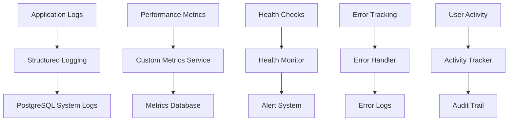

# Monitoramento e Logs

Sistema completo de observabilidade com logs estruturados, métricas e alertas.

## 📋 Visão Geral

O sistema de monitoramento do Operabase oferece observabilidade completa com logs estruturados, métricas de performance, alertas automatizados e dashboards para acompanhamento da saúde do sistema em tempo real.

## 📊 Arquitetura de Observabilidade

### Stack de Monitoramento



### Componentes Principais

1. **System Logs**: Logs estruturados para auditoria
2. **Performance Metrics**: Monitoramento de performance
3. **Health Checks**: Verificação de saúde dos serviços
4. **Error Tracking**: Rastreamento e análise de erros
5. **Activity Monitoring**: Monitoramento de atividade de usuários

## 📝 Sistema de Logs

### Logs Estruturados

```typescript
// server/shared/schemas/entities/system-log.schema.ts
interface SystemLog {
  id: number;
  clinic_id: number;
  entity_type: string;
  entity_id: number;
  action_type: string;
  actor_id?: string;
  actor_type: 'professional' | 'patient' | 'system' | 'api';
  actor_name?: string;
  professional_id?: number;
  related_entity_id?: number;
  previous_data?: any;
  new_data?: any;
  changes?: any;
  source: 'web' | 'mobile' | 'api' | 'webhook' | 'system';
  ip_address?: string;
  user_agent?: string;
  session_id?: string;
  created_at: Date;
}

// Tipos de ações monitoradas
type ActionType = 
  | 'created' | 'updated' | 'deleted' | 'viewed' 
  | 'login' | 'logout' | 'permission_changed'
  | 'payment_received' | 'appointment_scheduled' | 'message_sent'
  | 'ai_query' | 'file_uploaded' | 'export_generated';

type EntityType = 
  | 'contact' | 'appointment' | 'message' | 'medical_record'
  | 'anamnesis' | 'charge' | 'user' | 'clinic' | 'ai_query';
```

### Serviço de Logs

```typescript
// server/services/system-logs.service.ts
export class SystemLogsService {
  async logActivity(
    activityData: LogActivityData,
    metadata?: LogMetadata
  ): Promise<SystemLog> {
    try {
      const logEntry = await storage.createSystemLog({
        clinic_id: activityData.clinic_id,
        entity_type: activityData.entity_type,
        entity_id: activityData.entity_id,
        action_type: activityData.action_type,
        actor_id: activityData.actor_id,
        actor_type: activityData.actor_type,
        actor_name: activityData.actor_name,
        professional_id: activityData.professional_id,
        related_entity_id: activityData.related_entity_id,
        previous_data: activityData.previous_data,
        new_data: activityData.new_data,
        changes: activityData.changes,
        source: metadata?.source || 'web',
        ip_address: metadata?.ip_address,
        user_agent: metadata?.user_agent,
        session_id: metadata?.session_id,
        created_at: new Date()
      });

      // Processar logs em tempo real para alertas
      await this.processLogForAlerts(logEntry);

      return logEntry;

    } catch (error) {
      console.error('Error logging activity:', error);
      throw error;
    }
  }

  // Logs específicos por tipo de atividade
  async logMedicalActivity(
    action: string,
    entityId: number,
    clinicId: number,
    contactId: number | null,
    actorType: string,
    actorId: string | null,
    data: any,
    metadata?: LogMetadata
  ): Promise<void> {
    await this.logActivity({
      clinic_id: clinicId,
      entity_type: 'medical_record',
      entity_id: entityId,
      action_type: action,
      actor_id: actorId,
      actor_type: actorType,
      related_entity_id: contactId,
      new_data: data
    }, metadata);
  }

  async logFinancialActivity(
    action: string,
    entityId: number,
    clinicId: number,
    customerId: number,
    actorType: string,
    actorId: string | null,
    data: any,
    metadata?: LogMetadata
  ): Promise<void> {
    await this.logActivity({
      clinic_id: clinicId,
      entity_type: 'charge',
      entity_id: entityId,
      action_type: action,
      actor_id: actorId,
      actor_type: actorType,
      related_entity_id: customerId,
      new_data: data
    }, metadata);
  }

  async logWhatsAppActivity(
    action: string,
    entityId: number,
    clinicId: number,
    contactId: number | null,
    actorType: string,
    actorId: string | null,
    data: any,
    metadata?: LogMetadata
  ): Promise<void> {
    await this.logActivity({
      clinic_id: clinicId,
      entity_type: 'message',
      entity_id: entityId,
      action_type: action,
      actor_id: actorId,
      actor_type: actorType,
      related_entity_id: contactId,
      new_data: data
    }, metadata);
  }

  // Busca e filtros de logs
  async getActivityTimeline(
    clinicId: number,
    filters: {
      entity_type?: string;
      entity_id?: number;
      related_entity_id?: number;
      actor_id?: string;
      date_start?: string;
      date_end?: string;
      limit?: number;
    }
  ): Promise<SystemLog[]> {
    return storage.getSystemLogs(clinicId, {
      ...filters,
      order_by: 'created_at',
      order: 'DESC'
    });
  }

  async getPatientTimeline(
    contactId: number,
    clinicId: number,
    limit: number = 50
  ): Promise<PatientTimelineEntry[]> {
    const logs = await storage.getSystemLogs(clinicId, {
      related_entity_id: contactId,
      limit,
      order_by: 'created_at',
      order: 'DESC'
    });

    return logs.map(log => ({
      id: log.id,
      timestamp: log.created_at,
      action: this.formatActionForTimeline(log.action_type, log.entity_type),
      description: this.generateTimelineDescription(log),
      actor: log.actor_name || 'Sistema',
      entity_type: log.entity_type,
      metadata: log.new_data
    }));
  }

  private formatActionForTimeline(action: string, entityType: string): string {
    const actionMap: Record<string, string> = {
      'created': 'Criado',
      'updated': 'Atualizado',
      'deleted': 'Removido',
      'scheduled': 'Agendado',
      'cancelled': 'Cancelado',
      'completed': 'Finalizado',
      'sent': 'Enviado',
      'received': 'Recebido'
    };

    const entityMap: Record<string, string> = {
      'appointment': 'Agendamento',
      'medical_record': 'Prontuário',
      'message': 'Mensagem',
      'charge': 'Cobrança',
      'anamnesis': 'Anamnese'
    };

    return `${entityMap[entityType] || entityType} ${actionMap[action] || action}`;
  }

  private generateTimelineDescription(log: SystemLog): string {
    switch (log.entity_type) {
      case 'appointment':
        if (log.action_type === 'created') {
          return `Agendamento criado com ${log.new_data?.doctor_name || 'profissional'}`;
        }
        if (log.action_type === 'updated') {
          return `Agendamento atualizado`;
        }
        break;
      
      case 'medical_record':
        if (log.action_type === 'created') {
          return `Novo ${log.new_data?.record_type || 'registro'} médico criado`;
        }
        break;
      
      case 'message':
        if (log.action_type === 'sent') {
          return `Mensagem ${log.new_data?.message_type || 'texto'} enviada`;
        }
        break;
      
      case 'charge':
        if (log.action_type === 'payment_received') {
          return `Pagamento recebido: R$ ${(log.new_data?.value / 100).toFixed(2)}`;
        }
        break;
    }

    return `${log.entity_type} ${log.action_type}`;
  }

  private async processLogForAlerts(log: SystemLog): Promise<void> {
    // Processar logs para alertas em tempo real
    
    // Alertas de erro
    if (log.action_type.includes('error') || log.action_type.includes('failed')) {
      await this.sendErrorAlert(log);
    }

    // Alertas de atividade suspeita
    if (await this.detectSuspiciousActivity(log)) {
      await this.sendSecurityAlert(log);
    }

    // Alertas de negócio
    if (log.entity_type === 'charge' && log.action_type === 'payment_received') {
      await this.processPaymentAlert(log);
    }
  }

  private async detectSuspiciousActivity(log: SystemLog): Promise<boolean> {
    // Detectar múltiplos logins de IPs diferentes
    if (log.action_type === 'login' && log.ip_address) {
      const recentLogins = await storage.getSystemLogs(log.clinic_id, {
        entity_type: 'user',
        action_type: 'login',
        actor_id: log.actor_id,
        date_start: new Date(Date.now() - 60 * 60 * 1000).toISOString() // última hora
      });

      const uniqueIPs = new Set(recentLogins.map(l => l.ip_address));
      return uniqueIPs.size > 3; // Mais de 3 IPs diferentes em 1 hora
    }

    return false;
  }

  private async sendErrorAlert(log: SystemLog): Promise<void> {
    // Implementar alertas de erro via email/Slack/Discord
    console.error('🚨 Error Alert:', {
      clinic_id: log.clinic_id,
      entity_type: log.entity_type,
      action_type: log.action_type,
      actor: log.actor_name,
      error_data: log.new_data
    });
  }

  private async sendSecurityAlert(log: SystemLog): Promise<void> {
    // Implementar alertas de segurança
    console.warn('🔒 Security Alert:', {
      clinic_id: log.clinic_id,
      suspicious_activity: log.action_type,
      actor: log.actor_name,
      ip: log.ip_address
    });
  }

  private async processPaymentAlert(log: SystemLog): Promise<void> {
    // Notificar recebimento de pagamento
    console.info('💰 Payment Received:', {
      clinic_id: log.clinic_id,
      amount: log.new_data?.value,
      payment_method: log.new_data?.billing_type
    });
  }
}
```

## 📈 Métricas de Performance

### Coleta de Métricas

```typescript
// server/services/metrics.service.ts
export class MetricsService {
  private metrics: Map<string, MetricValue> = new Map();

  async recordMetric(
    name: string,
    value: number,
    tags?: Record<string, string>
  ): Promise<void> {
    const metric = {
      name,
      value,
      tags: tags || {},
      timestamp: new Date()
    };

    this.metrics.set(`${name}_${Date.now()}`, metric);

    // Persistir métricas importantes no banco
    if (this.shouldPersistMetric(name)) {
      await this.persistMetric(metric);
    }
  }

  async trackApiRequest(
    endpoint: string,
    method: string,
    statusCode: number,
    responseTime: number,
    clinicId?: number
  ): Promise<void> {
    await this.recordMetric('api_request_duration', responseTime, {
      endpoint,
      method,
      status_code: statusCode.toString(),
      clinic_id: clinicId?.toString() || 'unknown'
    });

    await this.recordMetric('api_request_count', 1, {
      endpoint,
      method,
      status_code: statusCode.toString()
    });
  }

  async trackWhatsAppMessage(
    clinicId: number,
    messageType: string,
    direction: 'inbound' | 'outbound',
    success: boolean
  ): Promise<void> {
    await this.recordMetric('whatsapp_message_count', 1, {
      clinic_id: clinicId.toString(),
      message_type: messageType,
      direction,
      success: success.toString()
    });
  }

  async trackAIQuery(
    clinicId: number,
    queryType: string,
    responseTime: number,
    success: boolean,
    knowledgeBaseUsed: boolean
  ): Promise<void> {
    await this.recordMetric('ai_query_duration', responseTime, {
      clinic_id: clinicId.toString(),
      query_type: queryType,
      success: success.toString(),
      knowledge_base_used: knowledgeBaseUsed.toString()
    });
  }

  async getMetrics(
    clinicId: number,
    timeRange: { start: Date; end: Date },
    metricNames?: string[]
  ): Promise<MetricsReport> {
    const metrics = await storage.getMetrics(clinicId, timeRange, metricNames);

    return {
      clinic_id: clinicId,
      time_range: timeRange,
      metrics: this.aggregateMetrics(metrics),
      generated_at: new Date()
    };
  }

  private aggregateMetrics(metrics: PersistedMetric[]): AggregatedMetrics {
    const grouped = metrics.reduce((acc, metric) => {
      if (!acc[metric.name]) {
        acc[metric.name] = [];
      }
      acc[metric.name].push(metric);
      return acc;
    }, {} as Record<string, PersistedMetric[]>);

    const aggregated: AggregatedMetrics = {};

    for (const [name, values] of Object.entries(grouped)) {
      aggregated[name] = {
        count: values.length,
        sum: values.reduce((sum, v) => sum + v.value, 0),
        avg: values.reduce((sum, v) => sum + v.value, 0) / values.length,
        min: Math.min(...values.map(v => v.value)),
        max: Math.max(...values.map(v => v.value)),
        latest: values[values.length - 1].value
      };
    }

    return aggregated;
  }

  async getDashboardMetrics(clinicId: number): Promise<DashboardMetrics> {
    const last24h = {
      start: new Date(Date.now() - 24 * 60 * 60 * 1000),
      end: new Date()
    };

    const [
      apiMetrics,
      whatsappMetrics,
      aiMetrics,
      systemHealth
    ] = await Promise.all([
      this.getAPIMetrics(clinicId, last24h),
      this.getWhatsAppMetrics(clinicId, last24h),
      this.getAIMetrics(clinicId, last24h),
      this.getSystemHealth()
    ]);

    return {
      clinic_id: clinicId,
      api: apiMetrics,
      whatsapp: whatsappMetrics,
      ai: aiMetrics,
      system: systemHealth,
      last_updated: new Date()
    };
  }

  private async getAPIMetrics(
    clinicId: number,
    timeRange: { start: Date; end: Date }
  ): Promise<APIMetrics> {
    const metrics = await this.getMetrics(clinicId, timeRange, [
      'api_request_duration',
      'api_request_count'
    ]);

    return {
      total_requests: metrics.metrics.api_request_count?.sum || 0,
      avg_response_time: metrics.metrics.api_request_duration?.avg || 0,
      error_rate: await this.calculateErrorRate(clinicId, timeRange),
      top_endpoints: await this.getTopEndpoints(clinicId, timeRange)
    };
  }

  private async getWhatsAppMetrics(
    clinicId: number,
    timeRange: { start: Date; end: Date }
  ): Promise<WhatsAppMetrics> {
    const metrics = await this.getMetrics(clinicId, timeRange, [
      'whatsapp_message_count'
    ]);

    return {
      total_messages: metrics.metrics.whatsapp_message_count?.sum || 0,
      inbound_messages: await this.countWhatsAppMessages(clinicId, timeRange, 'inbound'),
      outbound_messages: await this.countWhatsAppMessages(clinicId, timeRange, 'outbound'),
      delivery_rate: await this.calculateWhatsAppDeliveryRate(clinicId, timeRange)
    };
  }

  private async getAIMetrics(
    clinicId: number,
    timeRange: { start: Date; end: Date }
  ): Promise<AIMetrics> {
    const metrics = await this.getMetrics(clinicId, timeRange, [
      'ai_query_duration'
    ]);

    return {
      total_queries: await this.countAIQueries(clinicId, timeRange),
      avg_response_time: metrics.metrics.ai_query_duration?.avg || 0,
      success_rate: await this.calculateAISuccessRate(clinicId, timeRange),
      knowledge_base_usage: await this.calculateKnowledgeBaseUsage(clinicId, timeRange)
    };
  }

  private async getSystemHealth(): Promise<SystemHealth> {
    return {
      database_status: await this.checkDatabaseHealth(),
      memory_usage: process.memoryUsage().rss / 1024 / 1024, // MB
      cpu_usage: await this.getCPUUsage(),
      uptime: process.uptime(),
      last_check: new Date()
    };
  }
}
```

## 🚨 Sistema de Alertas

### Configuração de Alertas

```typescript
// server/services/alerts.service.ts
export class AlertsService {
  private alertRules: AlertRule[] = [
    {
      name: 'High Error Rate',
      condition: 'api_error_rate > 5%',
      severity: 'high',
      cooldown: 300000, // 5 minutos
      actions: ['email', 'slack']
    },
    {
      name: 'AI Response Time',
      condition: 'ai_avg_response_time > 10000', // 10 segundos
      severity: 'medium',
      cooldown: 600000, // 10 minutos
      actions: ['slack']
    },
    {
      name: 'WhatsApp Connection Down',
      condition: 'whatsapp_delivery_rate < 80%',
      severity: 'high',
      cooldown: 60000, // 1 minuto
      actions: ['email', 'slack', 'sms']
    },
    {
      name: 'Database Connection Issues',
      condition: 'database_status = "down"',
      severity: 'critical',
      cooldown: 30000, // 30 segundos
      actions: ['email', 'slack', 'sms', 'phone']
    }
  ];

  async checkAlerts(): Promise<void> {
    for (const rule of this.alertRules) {
      try {
        const shouldAlert = await this.evaluateRule(rule);
        
        if (shouldAlert && !this.isInCooldown(rule)) {
          await this.triggerAlert(rule);
          this.setCooldown(rule);
        }
      } catch (error) {
        console.error(`Error evaluating alert rule ${rule.name}:`, error);
      }
    }
  }

  private async evaluateRule(rule: AlertRule): Promise<boolean> {
    // Avaliar condições do alerta
    switch (rule.name) {
      case 'High Error Rate':
        return await this.checkErrorRate();
      
      case 'AI Response Time':
        return await this.checkAIResponseTime();
      
      case 'WhatsApp Connection Down':
        return await this.checkWhatsAppStatus();
      
      case 'Database Connection Issues':
        return await this.checkDatabaseStatus();
      
      default:
        return false;
    }
  }

  private async triggerAlert(rule: AlertRule): Promise<void> {
    const alert = {
      id: crypto.randomUUID(),
      rule_name: rule.name,
      severity: rule.severity,
      message: await this.generateAlertMessage(rule),
      triggered_at: new Date(),
      resolved_at: null
    };

    // Persistir alerta
    await storage.createAlert(alert);

    // Executar ações
    for (const action of rule.actions) {
      await this.executeAlertAction(action, alert);
    }

    console.warn(`🚨 Alert triggered: ${rule.name} [${rule.severity}]`);
  }

  private async executeAlertAction(action: string, alert: Alert): Promise<void> {
    switch (action) {
      case 'email':
        await this.sendEmailAlert(alert);
        break;
      
      case 'slack':
        await this.sendSlackAlert(alert);
        break;
      
      case 'sms':
        await this.sendSMSAlert(alert);
        break;
      
      case 'phone':
        await this.makePhoneCall(alert);
        break;
    }
  }

  private async sendEmailAlert(alert: Alert): Promise<void> {
    // Implementar envio de email
    console.log(`📧 Email alert sent: ${alert.rule_name}`);
  }

  private async sendSlackAlert(alert: Alert): Promise<void> {
    // Implementar integração com Slack
    console.log(`💬 Slack alert sent: ${alert.rule_name}`);
  }
}
```

## 🔧 Health Checks

### Monitoramento de Saúde

```typescript
// server/services/health-check.service.ts
export class HealthCheckService {
  async performHealthCheck(): Promise<HealthCheckResult> {
    const checks = await Promise.allSettled([
      this.checkDatabase(),
      this.checkRedis(),
      this.checkSupabase(),
      this.checkEvolutionAPI(),
      this.checkAsaas(),
      this.checkOpenAI(),
      this.checkDiskSpace(),
      this.checkMemory()
    ]);

    const results = checks.map((check, index) => {
      const checkNames = [
        'database', 'redis', 'supabase', 'evolution_api', 
        'asaas', 'openai', 'disk_space', 'memory'
      ];
      
      return {
        service: checkNames[index],
        status: check.status === 'fulfilled' ? 'healthy' : 'unhealthy',
        details: check.status === 'fulfilled' ? check.value : check.reason,
        timestamp: new Date()
      };
    });

    const overallStatus = results.every(r => r.status === 'healthy') ? 'healthy' : 'unhealthy';

    return {
      status: overallStatus,
      checks: results,
      timestamp: new Date(),
      uptime: process.uptime(),
      version: process.env.APP_VERSION || '1.0.0'
    };
  }

  private async checkDatabase(): Promise<ServiceCheck> {
    try {
      const start = Date.now();
      await storage.healthCheck();
      const responseTime = Date.now() - start;

      return {
        status: 'healthy',
        response_time: responseTime,
        details: 'Database connection successful'
      };
    } catch (error) {
      return {
        status: 'unhealthy',
        error: error.message,
        details: 'Database connection failed'
      };
    }
  }

  private async checkEvolutionAPI(): Promise<ServiceCheck> {
    try {
      const start = Date.now();
      // Verificar status da Evolution API
      const response = await fetch(`${process.env.EVOLUTION_API_URL}/instance/fetchInstances`, {
        headers: { 'apikey': process.env.EVOLUTION_API_KEY! }
      });
      
      const responseTime = Date.now() - start;

      if (response.ok) {
        return {
          status: 'healthy',
          response_time: responseTime,
          details: 'Evolution API responding'
        };
      } else {
        throw new Error(`HTTP ${response.status}`);
      }
    } catch (error) {
      return {
        status: 'unhealthy',
        error: error.message,
        details: 'Evolution API not responding'
      };
    }
  }

  private async checkOpenAI(): Promise<ServiceCheck> {
    try {
      const start = Date.now();
      const response = await fetch('https://api.openai.com/v1/models', {
        headers: { 'Authorization': `Bearer ${process.env.OPENAI_API_KEY}` }
      });
      
      const responseTime = Date.now() - start;

      if (response.ok) {
        return {
          status: 'healthy',
          response_time: responseTime,
          details: 'OpenAI API responding'
        };
      } else {
        throw new Error(`HTTP ${response.status}`);
      }
    } catch (error) {
      return {
        status: 'unhealthy',
        error: error.message,
        details: 'OpenAI API not responding'
      };
    }
  }

  private async checkDiskSpace(): Promise<ServiceCheck> {
    try {
      const stats = await fs.promises.statfs('.');
      const totalSpace = stats.bavail * stats.bsize;
      const freeSpace = stats.bavail * stats.bsize;
      const usedPercentage = ((totalSpace - freeSpace) / totalSpace) * 100;

      if (usedPercentage > 90) {
        return {
          status: 'unhealthy',
          details: `Disk usage: ${usedPercentage.toFixed(1)}%`,
          warning: 'Low disk space'
        };
      }

      return {
        status: 'healthy',
        details: `Disk usage: ${usedPercentage.toFixed(1)}%`
      };
    } catch (error) {
      return {
        status: 'unhealthy',
        error: error.message,
        details: 'Unable to check disk space'
      };
    }
  }

  private async checkMemory(): Promise<ServiceCheck> {
    const memUsage = process.memoryUsage();
    const memoryUsageMB = memUsage.rss / 1024 / 1024;
    const memoryUsagePercent = (memUsage.rss / (1024 * 1024 * 1024)) * 100; // Assumindo 1GB limite

    if (memoryUsagePercent > 80) {
      return {
        status: 'unhealthy',
        details: `Memory usage: ${memoryUsageMB.toFixed(1)}MB (${memoryUsagePercent.toFixed(1)}%)`,
        warning: 'High memory usage'
      };
    }

    return {
      status: 'healthy',
      details: `Memory usage: ${memoryUsageMB.toFixed(1)}MB`
    };
  }
}
```

## 🔧 Configuração e Troubleshooting

### Variáveis de Ambiente

```bash
# Monitoring Configuration
MONITORING_ENABLED=true
METRICS_RETENTION_DAYS=30
ALERTS_ENABLED=true
HEALTH_CHECK_INTERVAL=60000  # 1 minuto

# Log Configuration
LOG_LEVEL=info
LOG_FORMAT=json
LOG_RETENTION_DAYS=90
STRUCTURED_LOGGING_ENABLED=true

# Alert Configuration
ALERT_EMAIL_ENABLED=true
ALERT_SLACK_WEBHOOK=https://hooks.slack.com/services/...
ALERT_SMS_ENABLED=false

# Performance Monitoring
PERFORMANCE_MONITORING_ENABLED=true
SLOW_QUERY_THRESHOLD=5000  # 5 segundos
API_TIMEOUT_THRESHOLD=30000  # 30 segundos
```

### Queries de Monitoramento

```sql
-- Atividade recente por clínica
SELECT 
  clinic_id,
  entity_type,
  action_type,
  COUNT(*) as count,
  MAX(created_at) as last_activity
FROM system_logs 
WHERE created_at >= NOW() - INTERVAL '1 hour'
GROUP BY clinic_id, entity_type, action_type
ORDER BY count DESC;

-- Erros mais frequentes
SELECT 
  entity_type,
  action_type,
  COUNT(*) as error_count,
  MAX(created_at) as last_error
FROM system_logs 
WHERE action_type LIKE '%error%' 
  OR action_type LIKE '%failed%'
  AND created_at >= NOW() - INTERVAL '24 hours'
GROUP BY entity_type, action_type
ORDER BY error_count DESC;

-- Performance de APIs por endpoint
SELECT 
  new_data->>'endpoint' as endpoint,
  COUNT(*) as requests,
  AVG((new_data->>'response_time')::numeric) as avg_response_time,
  MAX((new_data->>'response_time')::numeric) as max_response_time
FROM system_logs 
WHERE entity_type = 'api_request'
  AND created_at >= NOW() - INTERVAL '1 hour'
GROUP BY new_data->>'endpoint'
ORDER BY avg_response_time DESC;
```

### Dashboard de Monitoramento

```typescript
// Endpoint para dashboard de monitoramento
router.get('/monitoring/dashboard', async (req, res) => {
  try {
    const { clinicId } = req.user;
    
    const [
      healthCheck,
      recentActivity,
      performanceMetrics,
      errorSummary
    ] = await Promise.all([
      healthCheckService.performHealthCheck(),
      systemLogsService.getActivityTimeline(clinicId, { limit: 20 }),
      metricsService.getDashboardMetrics(clinicId),
      systemLogsService.getErrorSummary(clinicId)
    ]);

    res.json({
      success: true,
      data: {
        health: healthCheck,
        activity: recentActivity,
        metrics: performanceMetrics,
        errors: errorSummary,
        generated_at: new Date()
      }
    });

  } catch (error) {
    console.error('Error getting monitoring dashboard:', error);
    res.status(500).json({ success: false, error: 'Failed to get monitoring data' });
  }
});
```

---

**Próximas Seções:**
- [Deployment e DevOps](deployment.md)
- [Segurança e Compliance](security.md)
- [Troubleshooting Avançado](troubleshooting.md) 